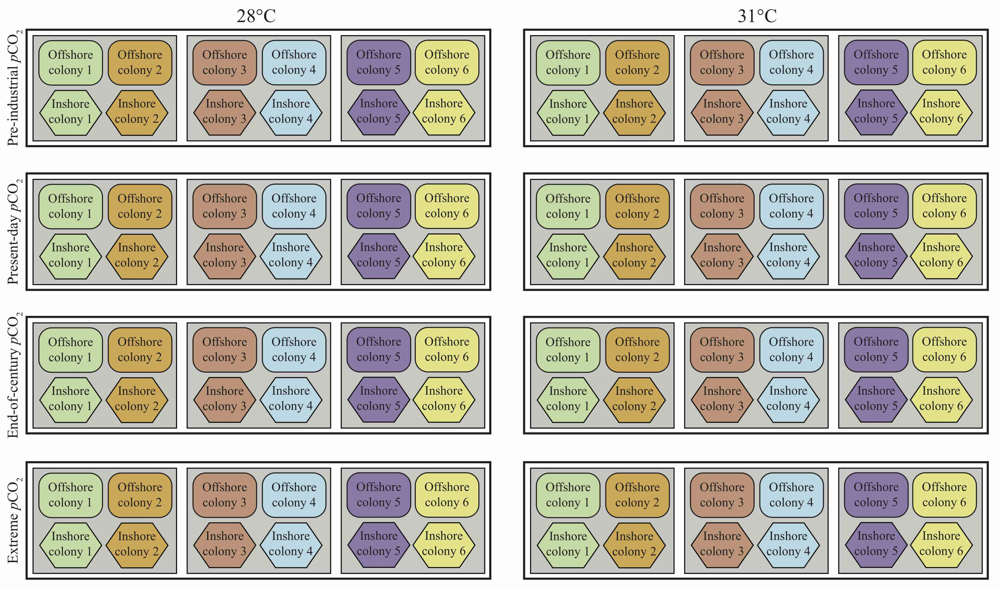

<style>
  h2{color: teal !important}
  h1{color: navy !important}
  body{background-color: gray95 !important}
</style>

<br/>

<center>
**This is a working document for all the coral physiology data manipulation, analysis, and visualization of the physiology manuscript. The document includes all figures, tables, supplemental materials, methods, and results for the manuscript. Each major analysis is separated by the tabs on the left.** 
</center>

<br/>

---


<br/>

```{r setup, include=FALSE}

knitr::opts_chunk$set(echo = FALSE, warning = FALSE, message = FALSE, options(knitr.kable.NA = ''))
options(warn = -1)

```

```{r install missing packages, eval=FALSE, message=FALSE, warning=FALSE, include=FALSE}

## install packages from source code
#install.packages("devtools") # if you need to install this package
#library("devtools")
#install_github("vqv/ggbiplot")
#install_github("cran/rcompanion") 


### Used packages that need to be installed to run code (and can be sourced easier from CRAN):
needed_packages <- c("knitr", "readr", "broom", "ggplot2", "dplyr", "ggbiplot", "tidyr", "corrgram", "openxlsx", "plotly", "tidyverse", "vegan", "shiny", "Rmisc", "cowplot", "ggfortify", "finalfit", "kableExtra", "readr", "lmerTest", "vroom", "ggpubr", "magick", "Hmisc", "corrplot", "gridGraphics", "grid", "RColorBrewer", "wesanderson", "performance", "MASS", "png", "car", "rcompanion", "janitor") # Specify necessary packages

not_installed <- needed_packages[!(needed_packages %in% installed.packages()[ , "Package"])] # Extract not installed packages) # Install not installed packages

```

```{r load packages, message=FALSE, warning=FALSE, include=FALSE}

## Packages to load
library(knitr)
library(readr)
library(broom)
library(ggplot2)
library(dplyr)
library(ggbiplot)
library(tidyr)
library(corrgram)
library(openxlsx)
library(plotly)
library(tidyverse)
library(vegan)
library(shiny)
library(Rmisc)
library(cowplot)
library(ggfortify)
library(finalfit)
library(kableExtra)
library(readr)
library(lmerTest)
library(vroom)
library(ggpubr)
library(magick)
library(Hmisc)
library(corrplot)
library(gridGraphics)
library(grid)
library(RColorBrewer)
library(wesanderson)
library(performance)
library(MASS)
library(png)
library(car)
library(rcompanion)
library(janitor)

## Source the custom functions necessary for running this script
source("Code/CustomFunctions.R")

```

```{r set formatting and labels, include=FALSE}

## Set some standards and units

# dodge width
dodge=position_dodge(width=0.3)
dodge2=position_dodge(width = 0.6)
jitter=position_jitter(width=0.1)

# set figure theme
theme_set(theme_pubr())

# set parameter labels
Tlab<-"Temperature (°C)"
alab<-expression(paste(italic("p"),"CO" [2]~ "("*mu,'atm)'))
dlab<-expression(paste("Cell density (10"^6,"cells cm"^-2,")"))
plab<-expression(paste("Total protein (mg cm"^-2,")"))
calab<-expression(paste("Carbohydrate (mg cm"^-2,")"))
clab<-expression(paste("Chlorophyll a ("*mu,"g cm"^-2,")"))
rlab<-expression(paste("Calcification rate (mg cm"^-2~"day"^-1,")"))
llab<-expression(paste("Total Lipid (mg cm"^-2,")"))
hlab<-expression(paste("Total Host (mg cm"^-2,")"))

# set the current date
date <- Sys.Date() 

```

```{r original dataframe adjustment, include=FALSE}

df <- read_csv("Data/Raw_data/phys_all_23March2021.csv")[-1] # read in full dataframe

# rename a couple columns
names(df)[38]<-"carb"
names(df)[39]<-"lipid"
names(df)[17]<-"sum"
names(df)[34]<-"red" 

# set columns as factors
df$ftemp <- as.factor(df$ftemp)
df$fpco2 <- as.factor(df$fpco2)
df$colony <- as.factor(df$colony)
df$species <- factor(df$species, levels = c("S", "P", "A", "T")) # and reorder these

# replace some pCO2 values with ones we will use moving forward
df$fpco2 <- gsub("2800", "3290", df$fpco2)
df$fpco2 <- gsub("280", "300", df$fpco2)
df$fpco2 <- gsub("400", "420", df$fpco2)
df$fpco2 <- gsub("700", "680", df$fpco2)

# reorder factors for pCO2 and temp
df$fpco2 <- factor(df$fpco2, c("420", "T0", "300", "680", "3290"))
df$ftemp <- factor(df$ftemp, c("28", "T0", "31"))

# calculate phys parameters
df$den <- (df$den / 1000000) # adjust symbiont density to display 10^6 cells
df$chla <- (df$chla / df$SA) # standardize chla to surface area
df$host <- df$pro + df$carb + df$lipid # calculate total host energy reserves (sum of carb, protein, lipids)
df$treat[df$T0_T90 == "T0"] <- "T0" # replace T0 'treat' with T0 text
df$treat <- factor(df$treat, levels = c("T0", "288_28", "311_31", "447_28", "405_31", "673_28", "701_31", "3285_28", "3309_31"),
                   labels = c("T0", "300_28", "300_31", "420_28", "420_31", "680_28", "680_31", "3290_28", "3290_31")) # adjust treatment levels

# add a new treat column for plotting (replacing actual treatment with number for better plotting - see plot XX)
df$treat2 <- df$treat
df$treat <- gsub("T0", 2, df$treat)
df$treat <- gsub("300_28", 4, df$treat)
df$treat <- gsub("300_31", 4, df$treat)
df$treat <- gsub("420_28", 6, df$treat)
df$treat <- gsub("420_31", 6, df$treat)
df$treat <- gsub("680_28", 8, df$treat)
df$treat <- gsub("680_31", 8, df$treat)
df$treat <- gsub("3290_28", 10, df$treat)
df$treat <- gsub("3290_31", 10, df$treat)
df$treat <- as.numeric(df$treat) # convert 'treat' column to numerics (again, this is for plotting only)

# inverse of colors (so lower color depicts more bleached coral)
df$sum <- (df$sum * -1)
df$red <- (df$red * -1)
df$blue_bw5 <- (df$blue_bw5 * -1)
df$green_bw5 <- (df$green_bw5 * -1)

## modify dataframe for simplified version
df2 <- df[,c(1:13, 41, 14:16, 37:40, 42:43, 17)] # select columns of interest only
df2 <- gather(df2, param, value, den:sum) # make column of parameter and value
df2$param <- factor(df2$param, levels = c("pro", "carb", "lipid", "den", "chla", "host", "count")) # reorder parameters
df2$species <- revalue(x = df2$species, c("S" = "SSID", "P" = "PSTR", "A" = "PAST", "T" = "UTEN")) # rename the species codes
df2 <- subset(df2, species != "UTEN") # remove UTEN (omitted due to high mortality in some treatments)

## remote T0 samples from dataframe for models
df2_T90 <- subset(df2, T0_T90 == "T90")

## add treatment column
df2_T90$treat2 <- paste0(df2_T90$fpco2, df2_T90$temp)

```

```{r bootstrap model setup}

## Performing the parametric bootstrapping of the model:
bootnum = 1500 # set number of iterations (we used 2000) between 999 and 9999
seed = 30 # seed to make results replicatable (our seed was 3)
set.seed(30)

```

```{r create dataframe per parameter}

## Create a forloop to subset the data by each parameter and save as individual dataframes 

# make a list of parameter names
param_list <- levels(df2_T90$param)

# forloop for dataframes
for (p in 1:length(param_list)) {
  param_select <- param_list[p]
  df_subset <- subset(df2_T90, param == param_select) # subset the dataframe for only one parameter
  df_subset <- completeFun(df_subset, "value") # run function to remove any missing values
  df_subset$value <- as.numeric(df_subset$value)
  df_subset$ftemp <- droplevels(df_subset$ftemp)
  df_subset$fpco2 <- droplevels(df_subset$fpco2)
  df_subset$colony <- droplevels(df_subset$colony)
  df_subset$species <- droplevels(df_subset$species)
  assign(paste(param_select, "mod_df", sep = "_"), df_subset) # assign the data to dataframe named for each parameter 
}

```

```{r T90 df setup}

df_withT <- df %>% filter(T0_T90 == "T90") %>% droplevels()
df_90 <- subset(df_withT, species != "T") 
df_90 <- df_90[,-c(18:33)]
df_90 <- completeFun(df_90, "den")
df_90 <- completeFun(df_90, "host")
df_90 <- completeFun(df_90, "lipid")
df_90 <- completeFun(df_90, "carb")
df_90_l <- gather(df_90, param, value, 14:23)

## specific species dataframes
s_df <- subset(df_90, species == "S") 
p_df <- subset(df_90, species == "P") 
a_df <- subset(df_90, species == "A") 

```


## Principal component analyses {.tabset}

#### *Methods:*
Principal component analysis (PCA) (function *prcomp*) of scaled and centered physiological parameters (host carbohydrate, host lipid, host protein, algal symbiont chlorophyll a, algal symbiont cell density, calcification rate as previously for the same samples in Bove et al (2019)) were employed to assess the relationship between physiological parameters and treatment conditions for each coral species. Main effects (temperature, *p*CO~2~, reef environment) were evaluated with PERMANOVA using the *adonis2* function (*vegan* package; version `r packageVersion("vegan")` (Oksanen et al., 2020)). No interactions between main effects were identified as significant, so interaction terms were dropped from each model resulting in fully additive models. 

<br/>
  
### *Siderastrea siderea*

```{r SSID PCA}

# set up the dataframe
s_df <- unique(s_df) # remove any duplicate rows
s_df_l <- gather(s_df, param, value, c(14:17,21:23))
s_df$fpco2 <- factor(s_df$fpco2, levels = c("300", "420", "680", "3290"))
sid_pca_df <- s_df[,c(14:17,21:23)]

# run the adonis
#s_pca_mod <- adonis2(sid_pca_df ~ reef * ftemp * fpco2, data = s_df, method = 'eu', permutations = bootnum) # below is the model with non sig interactions removed:
s_pca_mod <- adonis2(sid_pca_df ~ fpco2 + ftemp + reef, data = s_df, method = 'eu', permutations = bootnum, by = "margin")
s_pca_mod # view SSID adonis output

# extract pvalues
s_pval <- s_pca_mod["Pr(>F)"]

# perform principal component analysis (PCA)
s_pca <- prcomp(sid_pca_df, center = TRUE, scale= TRUE)

```

```{r SSID PCA plot, fig.height=8, fig.width=8}

# create labels for p values calculated above
s_pco2_pval <-substitute(italic(P[pCO[2]])==p, list(p = format(s_pval[1,1], digits = 1)))
s_temp_pval <-substitute(italic(P[temp])==p, list(p = format(s_pval[2,1], digits = 1)))
s_reef_pval <-substitute(italic(P[reef])==p, list(p = format(s_pval[3,1], digits = 1)))


# temperature
s_temp_pca <- autoplot(s_pca, data = s_df, 
         colour = "ftemp",
         #shape = "fpco2",
         shape = "ftemp",
         fill = "ftemp",               
         frame = TRUE, 
         frame.type = "t", # displaying ellipses with multivariate t-distributions for small n producing heavier tails
         frame.level = 0.95, # using 95% CI for all ellipses
         frame.alpha = 0.01,
         loadings = TRUE, 
         loadings.colour = "grey29", 
         loadings.label = TRUE,
         loadings.label.colour = "black",         
         loadings.label.size = 4, 
         loadings.label.hjust = 1.5, 
         loadings.label.vjust = 0.5,
         loadings.label.repel = TRUE) +
  #scale_shape_manual("pCO2", labels = c("pre industrial", "current", "end-of-century", "extreme"), values = c(21, 23, 24, 22)) +
  scale_shape_manual("temperature", labels = c("28C", "31C"), values = c(21, 21)) +
  scale_colour_manual("temperature", labels = c("28C", "31C"), values = c("#4393c3", "#b2182b"))+
  scale_fill_manual("temperature", labels = c("28C", "31C"), values = c("#4393c3", "transparent"))+
  guides(color = guide_legend(keyheight = 0.3, nrow = 4, byrow = TRUE, override.aes = list(linetype = c(0, 0)))) +
  theme(legend.title = element_blank(), legend.background = element_rect(fill = "transparent", color = NA)) +
  annotate("text", x = -0.30, y = -0.38, label = deparse(s_temp_pval), parse = TRUE, size = 3) +
  ggtitle(expression(paste(italic("S. siderea"))))

# pco2
s_pco2_pca <- autoplot(s_pca, data = s_df, 
         colour = "fpco2",
         #shape = "ftemp",
         fill = "fpco2",
         shape = "fpco2",
         frame = TRUE, 
         frame.type = "t", # displaying ellipses with multivariate t-distributions for small n producing heavier tails
         frame.level = 0.95, # using 95% CI for all ellipses
         frame.alpha = 0.01,
         loadings = TRUE, 
         loadings.colour = "grey29", 
         loadings.label = TRUE,
         loadings.label.colour = "black",         
         loadings.label.size = 4, 
         loadings.label.hjust = 1.5, 
         loadings.label.vjust = 0.5,
         loadings.label.repel = TRUE) +
    #scale_shape_manual("temperature", labels = c("28 C", "31 C"), values = c(19,21)) +
    scale_shape_manual("", labels = c("pre industrial", "current", "end-of-century", "extreme"), values = c(21, 23, 24, 22)) +
    scale_fill_manual("", labels = c("pre industrial", "current", "end-of-century", "extreme"), values = c("#b2abd2", "#5e3c99", "#fdb863", "#e66101"))+
    scale_color_manual("", labels = c("pre industrial", "current", "end-of-century", "extreme"), values = c("#b2abd2", "#5e3c99", "#fdb863", "#e66101"))+
    guides(color = guide_legend(nrow = 4, override.aes = list(linetype = c(0, 0, 0, 0)))) +
    theme(legend.background = element_rect(fill = "transparent", color = NA)) +
    annotate("text", x = -0.30, y = -0.38, label = deparse(s_pco2_pval), parse = TRUE, size = 3)

# reef
s_reef_pca <- autoplot(s_pca, data = s_df, 
         colour = "reef",
         fill = "reef",
         frame = TRUE, 
         frame.type = "t", # displaying ellipses with multivariate t-distributions for small n producing heavier tails
         frame.level = 0.95, # using 95% CI for all ellipses
         frame.alpha = 0.01,
         loadings = TRUE, 
         loadings.colour = "grey29", 
         loadings.label = TRUE,
         loadings.label.colour = "black",         
         loadings.label.size = 4, 
         loadings.label.hjust = 1.5, 
         loadings.label.vjust = 0.5,
         loadings.label.repel = TRUE) +
  scale_color_manual("reef environment", labels = c("offshore", "inshore"), values = c("#00a08b", "#e9aa2b")) +
  scale_fill_manual("reef environment", labels = c("offshore", "inshore"), values = c("#00a08b", "#e9aa2b")) +
  guides(fill = FALSE, color = guide_legend(keyheight = 0.3, nrow = 2, override.aes = list(linetype = c(0, 0))), shape = guide_legend(nrow = 2, override.aes = list(linetype = c(0, 0)))) +
  theme(legend.title = element_blank(), legend.background = element_rect(fill = "transparent", color = NA)) +
  annotate("text", x = -0.3, y = -0.38, label = deparse(s_reef_pval), parse = TRUE, size = 3) +
  ggtitle(expression(paste(bold("A)   "), italic("S. siderea"))))

# pco2 * temp
s_df$pco2_f <- factor(s_df$pco2, labels = c("pre industrial; 28C", "pre industrial; 31C", "current; 31C", "current; 28C", "end-of-century; 28C", "end-of-century; 31C", "extreme; 28C", "extreme; 31C"))
s_pt_pca <- autoplot(s_pca, data = s_df, 
         colour = "pco2_f",
         fill = "pco2_f",
         shape = "pco2_f",
         frame = TRUE, 
         frame.type = "t", # displaying ellipses with multivariate t-distributions for small n producing heavier tails
         frame.level = 0.95, # using 95% CI for all ellipses
         frame.alpha = 0.01,
         frame.size = 5,
         loadings = TRUE, 
         loadings.colour = "grey29", 
         loadings.label = TRUE,
         loadings.label.colour = "black",         
         loadings.label.size = 4, 
         loadings.label.hjust = 1.5, 
         loadings.label.vjust = 0.5,
         loadings.label.repel = TRUE) +
  scale_fill_manual("", values = c("#d1e5f0", "#fddbc7", "#f4a582", "#92c5de", "#4393c3", "#d6604d", "#2166ac", "#b2182b")) +
  scale_colour_manual("", values = c("#d1e5f0", "#fddbc7", "#f4a582", "#92c5de", "#4393c3", "#d6604d", "#2166ac", "#b2182b")) +
  scale_shape_manual("", values = c(19, 19, 17, 17, 15, 15, 8, 8)) +
  guides(fill = FALSE, color = guide_legend(keyheight = 0.3, nrow = 2, override.aes = list(linetype = c(0, 0))), shape = guide_legend(nrow = 2, override.aes = list(linetype = c(0, 0)))) +
  theme(legend.title = element_blank(), legend.background = element_rect(fill = "transparent", color = NA))

```

<br/>
<br/>


### *Pseudodiploria strigosa*

```{r PSTR PCA}

# set up the dataframe
p_df <- unique(p_df) # remove duplicate rows
p_df_l <- gather(p_df, param, value, c(14:16,21:23))
p_df$fpco2 <- factor(p_df$fpco2, levels = c("300", "420", "680", "3290"))
dip_pca_df <- p_df[,c(14:17,21:23)]

# run the adonis
#p_pca_mod <- adonis2(dip_pca_df ~ reef * ftemp * fpco2, data = p_df, method = 'eu', permutations = 1000) # below is the model with non sig interactions removed:
p_pca_mod <- adonis2(dip_pca_df ~ reef + ftemp + fpco2, data = p_df, method = 'eu', permutations = bootnum, by = "margin")
p_pca_mod # view PSTR adonis output

# extract pvalues
p_pval <- p_pca_mod["Pr(>F)"]

# perform principal component analysis (PCA)
p_pca <- prcomp(dip_pca_df, center = TRUE, scale= TRUE)

```

```{r PSTR PCA plot, fig.height=8, fig.width=8}

# create labels for p values calculated above
p_reef_pval <-substitute(italic(P[reef])==p, list(p = format(p_pval[1,1], digits = 1)))
p_temp_pval <-substitute(italic(P[temp])==p, list(p = format(p_pval[2,1], digits = 1)))
p_pco2_pval <-substitute(italic(P[pCO[2]])==p, list(p = format(p_pval[3,1], digits = 2)))


# temperature
p_temp_pca <- autoplot(p_pca, data = p_df, 
         colour = "ftemp",
         #shape = "fpco2",
         shape = "ftemp",
         fill = "ftemp",               
         frame = TRUE, 
         frame.type = "t", # displaying ellipses with multivariate t-distributions for small n producing heavier tails
         frame.level = 0.95, # using 95% CI for all ellipses
         frame.alpha = 0.01,
         loadings = TRUE, 
         loadings.colour = "grey29", 
         loadings.label = TRUE,
         loadings.label.colour = "black",         
         loadings.label.size = 4, 
         loadings.label.hjust = 1, 
         loadings.label.vjust = 0.5,
         loadings.label.repel = TRUE) +
  #scale_shape_manual("pCO2", labels = c("pre industrial", "current", "end-of-century", "extreme"), values = c(21, 23, 24, 22)) +
  scale_shape_manual("temperature", labels = c("28C", "31C"), values = c(21, 21)) +
  scale_color_manual("temperature", labels = c("28C", "31C"), values = c("#4393c3", "#b2182b"))+
  scale_fill_manual("temperature", labels = c("28C", "31C"), values = c("#4393c3", "transparent"))+
  guides(color = guide_legend(keyheight = 0.3, nrow = 4, byrow = TRUE, override.aes = list(linetype = c(0, 0)))) +
  theme(legend.title = element_blank(), legend.background = element_rect(fill = "transparent", color = NA)) +
  annotate("text", x = -0.13, y = -0.38, label = deparse(p_temp_pval), parse = TRUE, size = 3) +
  ggtitle(expression(paste(italic("P. strigosa"))))


# pco2
p_pco2_pca <- autoplot(p_pca, data = p_df, 
         colour = "fpco2",
         fill = "fpco2",
         #shape = "ftemp",
         shape = "fpco2",
         frame = TRUE, 
         frame.type = "t", # displaying ellipses with multivariate t-distributions for small n producing heavier tails
         frame.level = 0.95, # using 95% CI for all ellipses
         frame.alpha = 0.01,
         loadings = TRUE, 
         loadings.colour = "grey29", 
         loadings.label = TRUE,
         loadings.label.colour = "black",         
         loadings.label.size = 4, 
         loadings.label.hjust = 1, 
         loadings.label.vjust = 0.5,
         loadings.label.repel = TRUE) +
    #scale_shape_manual("temperature", labels = c("28 C", "31 C"), values = c(19,21)) +
    scale_shape_manual("", labels = c("pre industrial", "current", "end-of-century", "extreme"), values = c(21, 23, 24, 22)) +
    scale_fill_manual("", labels = c("pre industrial", "current", "end-of-century", "extreme"), values = c("#b2abd2", "#5e3c99", "#fdb863", "#e66101"))+
    scale_color_manual("", labels = c("pre industrial", "current", "end-of-century", "extreme"), values = c("#b2abd2", "#5e3c99", "#fdb863", "#e66101"))+
    guides(color = guide_legend(nrow = 4, override.aes = list(linetype = c(0, 0, 0, 0)))) +
    theme(legend.background = element_rect(fill = "transparent", color = NA)) +
    annotate("text", x = -0.28, y = -0.38, label = deparse(p_pco2_pval), parse = TRUE, size = 3)

# reef
p_reef_pca <- autoplot(p_pca, data = p_df, 
         colour = "reef",
         fill = "reef",
         frame = TRUE, 
         frame.type = "t", # displaying ellipses with multivariate t-distributions for small n producing heavier tails
         frame.level = 0.95, # using 95% CI for all ellipses
         frame.alpha = 0.01,
         loadings = TRUE, 
         loadings.colour = "grey29", 
         loadings.label = TRUE,
         loadings.label.colour = "black",         
         loadings.label.size = 4, 
         loadings.label.hjust = 1, 
         loadings.label.vjust = 0.5,
         loadings.label.repel = TRUE) +
  scale_color_manual("reef environment", labels = c("offshore", "inshore"), values = c("#00a08b", "#e9aa2b")) +
  scale_fill_manual("reef environment", labels = c("offshore", "inshore"), values = c("#00a08b", "#e9aa2b")) +
  guides(fill = FALSE, color = guide_legend(keyheight = 0.3, nrow = 2, override.aes = list(linetype = c(0, 0))), shape = guide_legend(nrow = 2, override.aes = list(linetype = c(0, 0)))) +
  theme(legend.title = element_blank(), legend.background = element_rect(fill = "transparent", color = NA)) +
  annotate("text", x = -0.17, y = -0.38, label = deparse(p_reef_pval), parse = TRUE, size = 3) +
  ggtitle(expression(paste(bold("B)   "), italic("P. strigosa"))))


# pco2 * temp
p_df$pco2_f <- factor(p_df$pco2, labels = c("pre industrial; 28C", "pre industrial; 31C", "current; 31C", "current; 28C", "end-of-century; 28C", "end-of-century; 31C", "extreme; 28C", "extreme; 31C"))
p_pt_pca <- autoplot(p_pca, data = p_df, 
         colour = "pco2_f",
         fill = "pco2_f",
         shape = "pco2_f",
         frame = TRUE, 
         frame.type = "t", # displaying ellipses with multivariate t-distributions for small n producing heavier tails
         frame.level = 0.95, # using 95% CI for all ellipses
         frame.alpha = 0.01,
         frame.size = 5,
         loadings = TRUE, 
         loadings.colour = "grey29", 
         loadings.label = TRUE,
         loadings.label.colour = "black",         
         loadings.label.size = 4, 
         loadings.label.hjust = 1.5, 
         loadings.label.vjust = 0.5,
         loadings.label.repel = TRUE) +
  scale_fill_manual("", values = c("#d1e5f0", "#fddbc7", "#f4a582", "#92c5de", "#4393c3", "#d6604d", "#2166ac", "#b2182b")) +
  scale_colour_manual("", values = c("#d1e5f0", "#fddbc7", "#f4a582", "#92c5de", "#4393c3", "#d6604d", "#2166ac", "#b2182b")) +
  scale_shape_manual("", values = c(19, 19, 17, 17, 15, 15, 8, 8)) +
  guides(fill = FALSE, color = guide_legend(keyheight = 0.3, nrow = 2, override.aes = list(linetype = c(0, 0))), shape = guide_legend(nrow = 2, override.aes = list(linetype = c(0, 0)))) +
  theme(legend.title = element_blank(), legend.background = element_rect(fill = "transparent", color = NA))

```

<br/>
<br/>


### *Porites astreoides*

```{r PAST PCA}

# set up the dataframe
a_df <- unique(a_df)
a_df <- a_df[-17,] # we have two from the same colony in 400_28 that are performing similarly so one is being removed (CFAD12)
a_df_l <- gather(a_df, param, value, c(14:16,21:23))
a_df$fpco2 <- factor(a_df$fpco2, levels = c("300", "420", "680", "3290"))
por_pca_df <- a_df[,c(14:16,18,21:23)]

# run the adonis
#a_pca_mod <- adonis2(por_pca_df ~ fpco2 * ftemp * reef, data = a_df, method = 'eu', permutations = 1000) # below is the model with non sig interactions removed:
a_pca_mod <- adonis2(por_pca_df ~ reef + ftemp + fpco2, data = a_df, method = 'eu', permutations = bootnum, by = "margin")
a_pca_mod # view PAST adonis output

# extract pvalues
a_pval <- a_pca_mod["Pr(>F)"]

# perform principal component analysis (PCA)
a_pca <- prcomp(por_pca_df, center = TRUE, scale= TRUE)

```

```{r PAST PCA plot, fig.height=8, fig.width=8}

# create labels for p values calculated above
a_reef_pval <-substitute(italic(P[reef])==p, list(p = format(a_pval[1,1], digits = 2)))
a_temp_pval <-substitute(italic(P[temp])==p, list(p = format(a_pval[2,1], digits = 1)))
a_pco2_pval <-substitute(italic(P[pCO[2]])==p, list(p = format(a_pval[3,1], digits = 1)))


# temperature
a_temp_pca <- autoplot(a_pca, data = a_df, 
         colour = "ftemp",
         #shape = "fpco2",
         shape = "ftemp",
         fill = "ftemp",               
         frame = TRUE, 
         frame.type = "t", # displaying ellipses with multivariate t-distributions for small n producing heavier tails
         frame.level = 0.95, # using 95% CI for all ellipses
         frame.alpha = 0.01,
         loadings = TRUE, 
         loadings.colour = "grey29", 
         loadings.label = TRUE,
         loadings.label.colour = "black",         
         loadings.label.size = 4, 
         loadings.label.hjust = 1, 
         loadings.label.vjust = 0.5,
         loadings.label.repel = TRUE) +
  #scale_shape_manual("pCO2", labels = c("pre industrial", "current", "end-of-century", "extreme"), values = c(21, 23, 24, 22)) +
  scale_shape_manual("temperature", labels = c("28C", "31C"), values = c(21, 21)) +
  scale_color_manual("temperature", labels = c("28C", "31C"), values = c("#4393c3", "#b2182b"))+
  scale_fill_manual("temperature", labels = c("28C", "31C"), values = c("#4393c3", "transparent"))+
  guides(color = guide_legend(keyheight = 0.3, nrow = 4, byrow = TRUE, override.aes = list(linetype = c(0, 0)))) +
  theme(legend.title = element_blank(), legend.background = element_rect(fill = "transparent", color = NA)) +
  annotate("text", x = -0.22, y = -0.44, label = deparse(a_temp_pval), parse = TRUE, size = 3) +
  ggtitle(expression(paste(italic("P. astreoides"))))

# pco2
a_pco2_pca <- autoplot(a_pca, data = a_df, 
         colour = "fpco2",
         fill = "fpco2",
         #shape = "ftemp",
         shape = "fpco2",
         frame = TRUE, 
         frame.type = "t", # displaying ellipses with multivariate t-distributions for small n producing heavier tails
         frame.level = 0.95, # using 95% CI for all ellipses
         frame.alpha = 0.01,
         loadings = TRUE, 
         loadings.colour = "grey29", 
         loadings.label = TRUE,
         loadings.label.colour = "black",         
         loadings.label.size = 4, 
         loadings.label.hjust = 1, 
         loadings.label.vjust = 0.5,
         loadings.label.repel = TRUE) +
    #scale_shape_manual("temperature", labels = c("28 C", "31 C"), values = c(19,21)) +
    scale_shape_manual("", labels = c("pre industrial", "current", "end-of-century", "extreme"), values = c(21, 23, 24, 22)) +
    scale_fill_manual("", labels = c("pre industrial", "current", "end-of-century", "extreme"), values = c("#b2abd2", "#5e3c99", "#fdb863", "#e66101"))+
    scale_color_manual("", labels = c("pre industrial", "current", "end-of-century", "extreme"), values = c("#b2abd2", "#5e3c99", "#fdb863", "#e66101"))+
    guides(color = guide_legend(nrow = 4, override.aes = list(linetype = c(0, 0, 0, 0)))) +
    theme(legend.background = element_rect(fill = "transparent", color = NA)) +
  annotate("text", x = -0.167, y = -0.5, label = deparse(a_pco2_pval), parse = TRUE, size = 3)

# reef
a_reef_pca <- autoplot(a_pca, data = a_df, 
         colour = "reef",
         fill = "reef",
         frame = TRUE, 
         frame.type = "t", # displaying ellipses with multivariate t-distributions for small n producing heavier tails
         frame.level = 0.95, # using 95% CI for all ellipses
         frame.alpha = 0.01,
         loadings = TRUE, 
         loadings.colour = "grey29", 
         loadings.label = TRUE,
         loadings.label.colour = "black",         
         loadings.label.size = 4, 
         loadings.label.hjust = 1, 
         loadings.label.vjust = 0.5,
         loadings.label.repel = TRUE) +
  scale_color_manual("reef environment", labels = c("offshore", "inshore"), values = c("#00a08b", "#e9aa2b")) +
  scale_fill_manual("reef environment", labels = c("offshore", "inshore"), values = c("#00a08b", "#e9aa2b")) +
  guides(fill = FALSE, color = guide_legend(keyheight = 0.3, nrow = 2, override.aes = list(linetype = c(0, 0))), shape = guide_legend(nrow = 2, override.aes = list(linetype = c(0, 0)))) +
  theme(legend.title = element_blank(), legend.background = element_rect(fill = "transparent", color = NA)) +
  annotate("text", x = -0.245, y = -0.38, label = deparse(a_reef_pval), parse = TRUE, size = 3) +
  ggtitle(expression(paste(bold("C)   "), italic("P. astreoides"))))


# pco2 * temp
a_df$pco2_f <- factor(a_df$pco2, labels = c("pre industrial; 28C", "pre industrial; 31C", "current; 31C", "current; 28C", "end-of-century; 28C", "end-of-century; 31C", "extreme; 28C", "extreme; 31C"))
a_pt_pca <- autoplot(a_pca, data = a_df, 
         colour = "pco2_f",
         fill = "pco2_f",
         shape = "pco2_f",
         frame = TRUE, 
         frame.type = "t", # displaying ellipses with multivariate t-distributions for small n producing heavier tails
         frame.level = 0.95, # using 95% CI for all ellipses
         frame.alpha = 0.01,
         frame.size = 5,
         loadings = TRUE, 
         loadings.colour = "grey29", 
         loadings.label = TRUE,
         loadings.label.colour = "black",         
         loadings.label.size = 4, 
         loadings.label.hjust = 1.5, 
         loadings.label.vjust = 0.5,
         loadings.label.repel = TRUE) +
  scale_fill_manual("", values = c("#d1e5f0", "#fddbc7", "#f4a582", "#92c5de", "#4393c3", "#d6604d", "#2166ac", "#b2182b")) +
  scale_colour_manual("", values = c("#d1e5f0", "#fddbc7", "#f4a582", "#92c5de", "#4393c3", "#d6604d", "#2166ac", "#b2182b")) +
  scale_shape_manual("", values = c(19, 19, 17, 17, 15, 15, 8, 8)) +
  guides(fill = FALSE, color = guide_legend(keyheight = 0.3, nrow = 2, override.aes = list(linetype = c(0, 0))), shape = guide_legend(nrow = 2, override.aes = list(linetype = c(0, 0)))) +
  theme(legend.title = element_blank(), legend.background = element_rect(fill = "transparent", color = NA))

```

<br/>
<br/>


### **Figure 1**

```{r PCA plot, fig.height=7, fig.width=13}

temp_PCA <- ggarrange(s_temp_pca, p_temp_pca, a_temp_pca, ncol = 3, common.legend = TRUE, legend = "bottom", labels = c("A", "B", "C"))
pCO2_PCA <- ggarrange(s_pco2_pca, p_pco2_pca, a_pco2_pca, ncol = 3, common.legend = TRUE, legend = "bottom", labels = c("D", "E", "F"))

ggarrange(temp_PCA, pCO2_PCA, nrow = 2) 
  ggsave("Figures/Final_Figures/Figure1_PhysPCA.pdf", width = 13, height = 8.5)
  ggsave("Figures/Final_Figures/Figure1_PhysPCA.png", width = 13, height = 8.5)

```

**Figure 1.** Principal component analysis (PCA) of all coral holobiont physiological parameters for (**A**) *S. siderea*, (**B**) *P. strigosa*, and (**C**) *P. astreoides* after 93 days of exposure to different temperature and *p*CO~2~ treatments. PCAs in the top row are depicted by temperature treatment for each species (28$^\circ$C blue; 31$^\circ$C red) and the bottom row of PCAs are depicted by *p*CO~2~ for each species (pre industrial [300 $\mu$atm], light purple; current day [420 $\mu$atm], dark purple; end-of-century [680 $\mu$atm], light orange; extreme [3290 $\mu$atm], dark orange). Arrows represent significant (p < 0.05) correlation vectors for physiological parameters (rate = calcification rate; den = symbiont density; chla = chlorophyll a; pro = protein; carb = carbohydrate; lipid = lipid; sum/red = color intensity) and ellipses represent 95% confidence based on multivariate t-distributions.

<br/>
<br/>


### **Figure 4**

```{r all PCA}

# set up the dataframe
all_df <- unique(df_90) # remove any duplicate rows
all_df_l <- gather(all_df, param, value, c(14:17,21:23))
all_df$fpco2 <- factor(all_df$fpco2, levels = c("300", "420", "680", "3290"))
all_pca_df <- all_df[,c(14:17,21:23)]

# run the adonis
#all_pca_mod <- adonis2(all_pca_df ~ reef * ftemp * fpco2 * species, data = all_df, method = 'eu', permutations = bootnum) # below is the model with non sig interactions removed:
all_pca_mod <- adonis2(all_pca_df ~ fpco2 + ftemp + reef + species + ftemp:species + fpco2:species + reef:species, data = all_df, method = 'eu', permutations = bootnum)
all_pca_mod # view all adonis output

# extract pvalues
all_pval <- all_pca_mod["Pr(>F)"]

# perform principal component analysis (PCA)
all_pca <- prcomp(all_pca_df, center = TRUE, scale= TRUE)

```

```{r all PCA plot, fig.height=8, fig.width=8}

# create labels for p values calculated above
all_pco2_pval <-substitute(italic(P[pCO[2]])==p, list(p = format(all_pval[1,1], digits = 1)))
all_temp_pval <-substitute(italic(P[temp])==p, list(p = format(all_pval[2,1], digits = 2)))
all_reef_pval <-substitute(italic(P[reef])==p, list(p = format(all_pval[3,1], digits = 1)))
all_species_pval <-substitute(italic(P[species])==p, list(p = format(all_pval[4,1], digits = 1)))
all_s_pco2_pval <-substitute(italic(P[species~X~pCO[2]])==p, list(p = format(all_pval[5,1], digits = 1)))
all_s_reef_pval <-substitute(italic(P[species~X~reef])==p, list(p = format(all_pval[6,1], digits = 2)))
all_s_temp_pval <-substitute(italic(P[species~X~temp])==p, list(p = format(all_pval[7,1], digits = 1)))


# species
species_pca_plot <- autoplot(all_pca, data = all_df, 
                       colour = "species",
                       #shape = "species",
                       #shape = "fpco2",
                       #fill = "species",               
                       frame = TRUE, 
                       frame.type = "t", # displaying ellipses with multivariate t-distributions for small n producing heavier tails
                       frame.level = 0.95, # using 95% CI for all ellipses
                       frame.alpha = 0.01,
                       loadings = TRUE, 
                       loadings.colour = "grey29", 
                       loadings.label = TRUE,
                       loadings.label.colour = "black",         
                       loadings.label.size = 4, 
                       loadings.label.hjust = 1.5, 
                       loadings.label.vjust = 0.5,
                       loadings.label.repel = TRUE) +
  scale_color_manual("", labels = c("S. siderea", "P. strigosa", "P. astreoides"), values = c("#867796", "#73CCD2", "#D2D69B")) +
  guides(shape = FALSE, fill = FALSE, color = guide_legend(keyheight = 0.1, nrow = 3, byrow = TRUE, override.aes = list(linetype = c(0, 0, 0)))) +
  theme(legend.title = element_blank(), legend.background = element_rect(fill = "transparent", color = NA), legend.position = c(0.16, 0.9), legend.text = element_text(face = "italic")) +
  annotate("text", x = -0.18, y = -0.108, label = deparse(all_species_pval), parse = TRUE, size = 3)

# temperature
all_temp_pca <- autoplot(all_pca, data = all_df, 
                       colour = "ftemp",
                       #shape = "fpco2",
                       shape = "ftemp",
                       fill = "ftemp",               
                       frame = TRUE, 
                       frame.type = "t", # displaying ellipses with multivariate t-distributions for small n producing heavier tails
                       frame.level = 0.95, # using 95% CI for all ellipses
                       frame.alpha = 0.01,
                       loadings = TRUE, 
                       loadings.colour = "grey29", 
                       loadings.label = TRUE,
                       loadings.label.colour = "black",         
                       loadings.label.size = 4, 
                       loadings.label.hjust = 1.5, 
                       loadings.label.vjust = 0.5,
                       loadings.label.repel = TRUE) +
  scale_shape_manual("temperature", labels = c("28C", "31C"), values = c(21, 21)) +
  scale_color_manual("temperature", labels = c("28C", "31C"), values = c("#4393c3", "#b2182b"))+
  scale_fill_manual("temperature", labels = c("28C", "31C"), values = c("#4393c3", "transparent"))+
  guides(color = guide_legend(keyheight = 0.3, nrow = 4, byrow = TRUE, override.aes = list(linetype = c(0, 0)))) +
  theme(legend.position = c(0.11, 0.9), legend.title = element_blank(), legend.background = element_rect(fill = "transparent", color = NA)) +
  annotate("text", x = -0.19, y = -0.118, label = deparse(all_temp_pval), parse = TRUE, size = 3) +
  annotate("text", x = -0.17, y = -0.14, label = deparse(all_s_temp_pval), parse = TRUE, size = 3)

# pco2
all_pco2_pca <- autoplot(all_pca, data = all_df, 
                       colour = "fpco2",
                       #shape = "ftemp",
                       fill = "fpco2",
                       shape = "fpco2",
                       frame = TRUE, 
                       frame.type = "t", # displaying ellipses with multivariate t-distributions for small n producing heavier tails
                       frame.level = 0.95, # using 95% CI for all ellipses
                       frame.alpha = 0.01,
                       loadings = TRUE, 
                       loadings.colour = "grey29", 
                       loadings.label = TRUE,
                       loadings.label.colour = "black",         
                       loadings.label.size = 4, 
                       loadings.label.hjust = 1.5, 
                       loadings.label.vjust = 0.5,
                       loadings.label.repel = TRUE) +
  scale_shape_manual("", labels = c("pre industrial", "current", "end-of-century", "extreme"), values = c(21, 23, 24, 22)) +
  scale_fill_manual("", labels = c("pre industrial", "current", "end-of-century", "extreme"), values = c("#b2abd2", "#5e3c99", "#fdb863", "#e66101"))+
  scale_color_manual("", labels = c("pre industrial", "current", "end-of-century", "extreme"), values = c("#b2abd2", "#5e3c99", "#fdb863", "#e66101"))+
  guides(color = guide_legend(nrow = 4, override.aes = list(linetype = c(0, 0, 0, 0)))) +
  annotate("text", x = -0.19, y = -0.118, label = deparse(all_pco2_pval), parse = TRUE, size = 3) +
  annotate("text", x = -0.17, y = -0.14, label = deparse(all_s_pco2_pval), parse = TRUE, size = 3) +
  theme(legend.position = c(0.18, 0.9), legend.background = element_rect(fill = "transparent", color = NA))

```

```{r species PCA plot, fig.width = 13, fig.height = 4}

ggarrange(species_pca_plot, all_pco2_pca, all_temp_pca, nrow =1, labels = "AUTO")
  ggsave("Figures/Final_Figures/Figure4_SpeciesPCA.pdf", width = 13, height = 4)
  ggsave("Figures/Final_Figures/Figure4_SpeciesPCA.png", width = 13, height = 4)

```

**Figure 4.** Principal component analysis (PCA) comparing the coral holobiont of all three species at the end of the experiment depicted by (**A**) species, (**B**) *p*CO~2~ treatment, and (**C**) temperature treatment. Arrows represent significant (p < 0.05) correlation vectors for physiological parameters and ellipses represent 95% confidence based on multivariate t-distributions.

<br/>
<br/>

### **Results**

#### *Principal component analysis*

Two principal components (PCs) explained approximately `r round(sum(summary(s_pca)[["importance"]][2,1] + summary(s_pca)[["importance"]][2,2]) * 100, 0)`% of the variance in physiological responses of the *S. siderea* holobiont to ocean acidification and warming treatments (**Figure 1A**). PC1 was driven by differences in algal symbiont physiology (chlorophyll a, cell density), while PC2 represented an inverse relationship between host energy reserves (lipid, protein, carbohydrate) and calcification rates and color intensities. Overall, lower *p*CO~2~ and temperature resulted in  higher *S. siderea* holobiont physiology (**Figure 1A**). Treatment *p*CO~2~ predominantly drove *S. siderea* physiological responses (p = `r format(s_pval[1,1], digits = 1)`; **Table S2**), while temperature and reef environment did not explain as much variation in physiological responses (p = `r format(s_pval[2,1], digits = 1)` and p = `r format(s_pval[3,1], digits = 1)`, respectively; **Table S2; Figure S1A**).  

For *P. strigosa*, `r round(sum(summary(p_pca)[["importance"]][2,1] + summary(p_pca)[["importance"]][2,2]) * 100, 0)`% of the variance in the holobiont responses to treatments was explained by two PCs (**Figure 1B**). PC1 explained most of the variation of physiological parameters with the exception of host lipid content, which was represented in PC2. Holobiont physiology of *P. strigosa* was reduced under warming (p = `r format(p_pval[2,1], digits = 1)`; **Table S2**) and in offshore samples (p = `r format(p_pval[1,1], digits = 1)`; **Table S2; Figure S1B**), however, *p*CO~2~ did not clearly impact holobiont physiology (**Figure 1B**; p = `r format(p_pval[3,1], digits = 1)`; **Table S2**). 

For *P. astreoides*, the first two PCs explained about `r round(sum(summary(a_pca)[["importance"]][2,1] + summary(a_pca)[["importance"]][2,2]) * 100, 0)`% of the total variance in holobiont response to treatment (**Figure 1C**). Samples separated most clearly along PC1 driven primarily by calcification rate and algal symbiont density, while PC2 exhibited an inverse relationship between host total carbohydrate and color intensity. Overall, lower *p*CO~2~ drove higher *P. astreoides* holobiont physiology, while elevated temperature resulted in greater holobiont physiology (**Figure 1C**). Temperature (p = `r format(a_pval[2,1], digits = 1)`; **Table S2**) and *p*CO~2~ (p = `r format(a_pval[3,1], digits = 1)`; **Table S2**) clearly altered  *P. astreoides* holobiont physiology, while reef environment was not significant (p = `r format(a_pval[1,1], digits = 1)`; **Table S2; Figure S1C**).  

<br/>

#### *Species differences in coral holobiont physiology*

The first two PCs of the combined holobiont physiology explained about `r round(sum(summary(all_pca)[["importance"]][2,1] + summary(all_pca)[["importance"]][2,2]) * 100, 0)`% of the total variance across samples (**Figure 4**). In general, fragments of *S. siderea* contained higher chlorophyll a content, host carbohydrate, and host lipid content, while *P. strigosa* fragments typically had greater host protein content accompanied by higher calcification rates, and fragments of *P. astreoides* were differentiated by their high symbiont densities (**Figure 4A; Table S5**). Despite being different coral species, coral holobiont physiology exhibited similar physiological responses to *p*CO~2~ and temperature treatments (**Figure 4B, 4C; Table S5**). As *p*CO~2~ or temperature increased, coral holobiont physiology was more constrained and exhibited convergent physiological responses under stress. Furthermore, corals from the inshore reef environment exhibited more constrained physiology than their offshore counterparts (**Figure S7; Table S5**).

<br/>
<br/>


## Correlation assessments {.tabset}

#### *Methods:*
Correlations of all physiological parameters were assessed to determine the relationships between parameters within each species. The Pearson correlation coefficient (R^2^) of each comparison was calculated using the corrgram package (version `r packageVersion("corrgram")` (Wright, 2018)) and the significance was calculated using the *cor.test* function. These relationships were then visualized through simple scatterplots.

<br/>


```{r SSID correlation matrix and scatter plots, results='hide'}

## Create new correlation dataframe for SSID
sid_corr_df <- s_df[,c(10:11,14:17,21:23)] %>% 
  mutate(shape = case_when(ftemp == "28" ~ "19",
                           ftemp == "31" ~ "21"),
         color = case_when(fpco2 == "300" ~ "#b2abd2",
                            fpco2 == "420" ~ "#5e3c99",
                            fpco2 == "680" ~ "#fdb863",
                            fpco2 == "3290" ~ "#e66101"))

## Plot correlation matrix and scatter plot of all SSID physiology  
png(file = "Figures/Supplemental_Figures/SSID_PhysCorrelations.png", width = 240.57, height = 164.025, units='mm', res = 300)  

corrgram(sid_corr_df, order = FALSE, lower.panel = panel.fill.R2, upper.panel = panel.pts.col, text.panel = panel.txt.brdr,
         col.regions = colorRampPalette(c("#ffffcc", "#c7e9b4", "#225ea8")), 
         color = sid_corr_df$color, pch = as.numeric(as.character(sid_corr_df$shape)),
         labels = c("symbiont \ndensity", "host \nprotein", "chlorophyll a", "color \nintensity", "calcification \nrate", "host \ncarbohydrate", "host \nlipid")) 

dev.off() 

```

```{r PSTR correlation matrix and scatter plots, results='hide'}

## Create new correlation dataframe for SSID
dip_corr_df <- p_df[,c(10:11,14:17,21:23)] %>% 
  mutate(shape = case_when(ftemp == "28" ~ "19",
                           ftemp == "31" ~ "21"),
         color = case_when(fpco2 == "300" ~ "#b2abd2",
                            fpco2 == "420" ~ "#5e3c99",
                            fpco2 == "680" ~ "#fdb863",
                            fpco2 == "3290" ~ "#e66101"))
  

## Plot correlation matrix and scatter plot of all PSTR physiology
png(file = "Figures/Supplemental_Figures/PSTR_PhysCorrelations.png", width = 240.57, height = 164.025, units='mm', res = 300) 

corrgram(dip_corr_df, order = FALSE, lower.panel=panel.fill.R2, upper.panel=panel.pts.col, text.panel=panel.txt.brdr,
         col.regions=colorRampPalette(c("#ffffcc", "#c7e9b4", "#225ea8")), 
         color = dip_corr_df$color, pch = as.numeric(as.character(dip_corr_df$shape)),
         labels = c("symbiont \ndensity", "host \nprotein", "chlorophyll a", "color \nintensity", "calcification \nrate", "host \ncarbohydrate", "host \nlipid")) 

dev.off() 

```

```{r PAST correlation matrix and scatter plots, results='hide'}

## Create new correlation dataframe for SSID
por_corr_df <- a_df[,c(10:11,14:16,18,21:23)] %>% 
  mutate(shape = case_when(ftemp == "28" ~ "19",
                           ftemp == "31" ~ "21"),
         color = case_when(fpco2 == "300" ~ "#b2abd2",
                            fpco2 == "420" ~ "#5e3c99",
                            fpco2 == "680" ~ "#fdb863",
                            fpco2 == "3290" ~ "#e66101"))
  

## Plot correlation matrix and scatter plot of all PAST physiology
png(file = "Figures/Supplemental_Figures/PAST_PhysCorrelations.png", width = 240.57, height = 164.025, units='mm', res = 300) 

corrgram(por_corr_df, order = FALSE, lower.panel=panel.fill.R2, upper.panel=panel.pts.col, text.panel=panel.txt.brdr,
         col.regions=colorRampPalette(c("#ffffcc", "#c7e9b4", "#225ea8")), 
         color = por_corr_df$color, pch = as.numeric(as.character(por_corr_df$shape)),
         labels = c("symbiont \ndensity", "host \nprotein", "chlorophyll a", "color \nintensity", "calcification \nrate", "host \ncarbohydrate", "host \nlipid")) 

dev.off() 

```


### **Figure 2**

```{r save all species correlation/scatter plots, fig.width = 12, fig.height = 3.3}

ssid_corr_plot <- readPNG("Figures/Supplemental_Figures/SSID_PhysCorrelations.png")
pstr_corr_plot <- readPNG("Figures/Supplemental_Figures/PSTR_PhysCorrelations.png")
past_corr_plot <- readPNG("Figures/Supplemental_Figures/PAST_PhysCorrelations.png")

ssid_corr_plot <- ggplot() + 
  background_image(ssid_corr_plot) + 
  theme_void() + 
  ggtitle(expression(paste(bold("  A)   "), italic("S. siderea"))))

pstr_corr_plot <- ggplot() + 
  background_image(pstr_corr_plot) + 
  theme_void() + 
  ggtitle(expression(paste(bold("  B)   "), italic("P. strigosa"))))

past_corr_plot <- ggplot() + 
  background_image(past_corr_plot) + 
  theme_void() + 
  ggtitle(expression(paste(bold("  C)   "), italic("P. asteroides"))))

ggarrange(ssid_corr_plot, pstr_corr_plot, past_corr_plot, nrow = 1)
  ggsave("Figures/Final_Figures/Figure2_PhysCorrelations.pdf", width = 12, height = 3.1)
  ggsave("Figures/Final_Figures/Figure2_PhysCorrelations.png", width = 12, height = 3.1)

```

**Figure 2.** Coral holobiont physiological parameter scatter plots (top) and correlation matrices (bottom) for (**A**) *S. siderea*, (**B**) *P. strigosa*, and (**C**) *P. astreoides* showing pairwise comparisons of within each species. Scatter plots of each pairwise combination of physiological parameters are displayed on the top with temperature treatment depicted by shape (28$^\circ$C closed points; 31$^\circ$C open points) and *p*CO~2~ treatment depicted by color (pre industrial [300 $\mu$atm], light purple; current day [420 $\mu$atm], dark purple; end-of-century [680 $\mu$atm], light orange; extreme [3290 $\mu$atm], dark orange). Strengths of the correlations (R^2^ via Pearson correlation coefficients) between each pairwise combination of physiological parameters are indicated by darker shades of blue on the bottom with significance depicted by asterisks according to significance level (\* p < 0.05; \*\* p < 0.01; \*\*\* p < 0.001). R^2^ and significance levels correspond to the scatter plot at the intersection between two physiological parameters. 

<br/>
<br/>


### **Results**

#### *Correlations of physiological parameters*

Coral holobiont physiological parameters were generally positively correlated with one another within each of the three species. Correlations between *S. siderea* holobiont physiological parameters identified 15 significant relationships out of all 21 possible comparisons (**Figure 2A**). Of those significant correlations, six resulted in a Pearson's correlation coefficient (R^2^) equal to or greater than 0.5, with the strongest relationship identified between symbiont density and chlorophyll a (R^2^ = 0.72).   

All pairwise physiological parameters were significantly correlated with one another in *P. strigosa* and, of those, 15 correlations exhibit moderate (R^2^ > 0.50) positive relationships (**Figure 2B**). Notably, the two strongest correlations were host carbohydrate vs. host protein (R^2^ = 0.70) and host carbohydrate vs. chlorophyll a (R^2^ = 0.76).  

Compared to both *S. siderea* and *P. strigosa*, fewer physiological traits were significantly (p < 0.05) correlated with one another in *P. astreoides* (12 significant out of 21 total comparisons; **Figure 2C**). Of the significant correlations, only two pairwise comparisons resulted in a Pearson's correlation coefficient greater than 0.5: chlorophyll a vs. color intensity (R^2^ = 0.57) and host carbohydrate vs. host protein (R^2^ = 0.68).

<br/>
<br/>


## Plasticity analyses {.tabset} 

#### *Methods:*
Physiological plasticity of each experimental fragment was calculated for each species using all seven PCs calculated above as the distance between an experimental fragment and the control (420 $\mu$atm; 28$^\circ$C) fragment from that same colony. The effects of treatment (*p*CO~2~ and temperature) and natal reef environment on calculated distances were assessed using generalized linear mixed effects models (function *lmer*) with a Gamma distribution and log-link and a random effect for colony. The best-fit model was selected as the model with the lowest AIC for each species (**Table S1**). Natal reef environment was only a significant predictor of plasticity in *S. siderea* so samples were pooled across reef environments for both *P. strigosa* and *P. astreoides*. Parametric bootstraps were performed to model mean response and 95% confidence intervals with 1500 iterations and significant effects were identified as non-overlapping confidence intervals. Marginal and conditional R^2^ values were calculated using the *r2_nakagawa* function in the rcompanion package (version `r packageVersion("rcompanion")` (Mangiafico, 2021)). All figures and statistical analyses were carried out in `r paste0("R version ", R.Version()$major, ".", R.Version()$minor)` (R Core Team, 2018) and the accompanying data and code can be freely accessed on GitHub  ([github.com/seabove7/Bove_CoralPhysiology](github.com/seabove7/Bove_CoralPhysiology)) and Zenodo (*DOI here when close to finished*).


<br/>

### *Siderastrea siderea*

```{r SSID distance analysis, include=FALSE}

## Calculate the PCA distance with custom function
sid_dist <- PCAplast(pca = s_pca, # the PCA dataframe containing the PCA eigenvalues
          data = s_df[,c(1,7,8, 10,11,12,27,2)], # the condition/treatment data corresponding to samples
          sample_ID = "coral", # the name of column that provide unique ID per sample (if blank, will pull rownames for this)
          num_pca =  "all", # the number of PCAs to include in analysis (default is 'all', but you can specify another number with a minimum of 2 PCAs)
          control_col = "treat2", # what the 'treatment' column is called
          control_lvl = "420_28", # control level of the treatment 
          group = "colony") # the grouping column (i.e., colony)


# with strong random effects of colony??
# marginal R2 --> fixed v random effect variance: likely more variance at colony level over treatment

ssid_dist_mod <- glmer(dist ~ reef * fpco2 * ftemp + (1 | colony), family = Gamma(link = "log"), data = sid_dist)
ssid_dist_mod2 <- glmer(dist ~ reef * fpco2 + ftemp + (1 | colony), family = Gamma(link = "log"), data = sid_dist)
ssid_dist_mod2b <- glmer(dist ~ reef * fpco2 + ftemp + (1 | colony) + (1 | tank), family = Gamma(link = "log"), data = sid_dist)
ssid_dist_mod3 <- glmer(dist ~ reef + fpco2 * ftemp + (1 | colony), family = Gamma(link = "log"), data = sid_dist)
ssid_dist_mod4 <- glmer(dist ~ reef + fpco2 + ftemp + (1 | colony), family = Gamma(link = "log"), data = sid_dist)
ssid_dist_mod5 <- glmer(dist ~ reef * (fpco2 + ftemp) + (1 | colony), family = Gamma(link = "log"), data = sid_dist)
ssid_dist_mod6 <- glmer(dist ~ fpco2 + ftemp + (1 | colony), family = Gamma(link = "log"), data = sid_dist) # best fit

# check for best-fit model
ssid_plast_aic <- compare_performance(ssid_dist_mod, ssid_dist_mod2, ssid_dist_mod2b, ssid_dist_mod3, ssid_dist_mod4, ssid_dist_mod5, ssid_dist_mod6, rank = TRUE)
#plot(ssid_plast_aic)


## Best-fit GLMM with Gamma log link
ssid_dist_glm <- glmer(dist ~ reef * fpco2 + ftemp + (1 | colony) + (1 | tank), family = Gamma(link = "log"), data = sid_dist)
ssid_glm_out <- summary(ssid_dist_glm) # summary output of the GLM


## conditional and marginal R2
r2_nakagawa(ssid_dist_glm)
#  Conditional R2: 0.542 -- fixed and random effects
#     Marginal R2: 0.307 -- fixed effects only

## Below info taken from appendix 3 of Gok A, Ngendahimana DK, Fagerholm CL, French RH, Sun J, Bruckman LS (2017) Predictive models of poly(ethylene-terephthalate) film degradation under multi-factor accelerated weathering exposures. PLoS ONE 12(5): e0177614. https://doi.org/10.1371/journal.pone.0177614

# "Marginal and conditional are R2 values for generalized mixed-effects models
# calculated using the r.squaredGLMM function of the MuMIn [1] package that
# implements a method developed by Nakagawa and Schielzeth [2]. Marginal R2
# provides the variance explained only by fixed effects and conditional R2
# provides the variance explained by the entire model, i.e., both fixed effects 
# and random effects. Fitted R2 is analogous to adjusted R2 generalized for 
# measuring explained variation in linear mixed-effects models [3]."

```

```{r SSID plasticity bootstrapping, eval=FALSE, include=FALSE}

## Pull the treatment and distance data from the model
newdata_ssid <- data.frame(ssid_dist_glm@frame[-1])

## Bootstrap distances using custom bootstrap function
ssid_boot_out <- replicate(bootnum, bootFUN(model = ssid_dist_glm, newdata = newdata_ssid)) 

## Calculate the mean, 95% lowerCI, and 95% upperCI from the boot matrix and add it to dataframe
ssid_boot <- cbind(sid_dist, as.data.frame(t(apply(ssid_boot_out, 1, function(x) c(mean(x), quantile(x, c(0.025, 0.975)))))))
colnames(ssid_boot)[10:12] <- c("estimate", "lowerci", "upperci") # rename mean/CI columns

## save as rda object
save(ssid_boot, file = "Data/Bootstrap/SSID_PlastBoot.rda")

```

```{r plots of SSID distances}

## Load boot data
load(file = "Data/Bootstrap/SSID_PlastBoot.rda")
ssid_boot$treat2 <- paste(ssid_boot$fpco2, ssid_boot$ftemp, sep = "_") # need to rename treatments with the mean pCO2, not temp-specific ones
ssid_boot$treat2 <- factor(ssid_boot$treat2,
                           levels = c("300_28", "300_31", "420_31", "680_28", "680_31", "3290_28", "3290_31"),
                           labels = c("pre industrial; 28C", "pre industrial; 31C", "current; 31C", "end-of-century; 28C", "end-of-century; 31C", "extreme; 28C", "extreme; 31C")) # adjust treatment levels


## Plasticity plot
ssid_plast_plot <- ggplot(ssid_boot, aes(x = reef, y = estimate, color = treat2, fill = treat2, shape = treat2)) +
  theme_pubr() +
  theme(legend.title = element_blank(), axis.ticks.x = element_blank()) +
  guides(shape = guide_legend(ncol = 1), fill = guide_legend(override.aes = list(linetype = 0)), color = guide_legend(override.aes = list(linetype = 0))) +
  geom_point(aes(x = reef, y = dist), size = 2, alpha = 0.4, position = position_jitterdodge(jitter.width = 0.3, dodge.width = 0.55)) +
  geom_linerange(aes(ymin = lowerci, ymax =upperci), size = 1, position = position_dodge(width = 0.55)) +
  geom_point(size = 3, alpha = 0.8, stroke = 1, position = position_dodge(width = 0.55)) +
  scale_shape_manual(values = c(21, 21, 23, 24, 24, 22, 22)) +
  scale_color_manual(values = c("#b2abd2", "#b2abd2", "#5e3c99", "#fdb863", "#fdb863", "#e66101", "#e66101")) + 
  scale_fill_manual(values = c("#b2abd2", "white", "white", "#fdb863", "white", "#e66101", "white")) + 
  labs(y = "PC distance from control", x = "") +
  scale_y_continuous(expand = c(0, 0), limits = c(0, 8)) +
  scale_x_discrete(labels = c("F" = "Offshore", "N" = "Inshore")) +
  ggtitle(expression(paste(bold("A)   "), italic("S. siderea"))))
  

## Model output and R2
ssid_glm_out # summary output of the GLMER
r2_nakagawa(ssid_dist_glm) # conditional and marginal R2

```

<br/>
<br/>


### *Pseudodiploria strigosa*

```{r PSTR distance analysis, include=FALSE}

## Calculate the PCA distance with custom function
dip_dist <- PCAplast(pca = p_pca, # the PCA dataframe containing the PCA eigenvalues
          data = p_df[,c(1,7,8, 10,11,12,27,2)], # the condition/treatment data corresponding to samples
          sample_ID = "coral", # the name of column that provide unique ID per sample (if blank, will pull rownames for this)
          num_pca =  "all", # the number of PCAs to include in analysis (default is 'all', but you can specify another number with a minimum of 2 PCAs)
          control_col = "treat2", # what the 'treatment' column is called
          control_lvl = "420_28", # control level of the treatment 
          group = "colony") # the grouping column (i.e., colony)


## Model selection (via AIC)
pstr_dist_mod <- glmer(dist ~ reef * fpco2 * ftemp + (1 | colony), family = Gamma(link = "log"), data = dip_dist)
pstr_dist_mod2 <- glmer(dist ~ reef * fpco2 + ftemp + (1 | colony), family = Gamma(link = "log"), data = dip_dist)
pstr_dist_mod3 <- glmer(dist ~ reef + fpco2 * ftemp + (1 | colony), family = Gamma(link = "log"), data = dip_dist)
#pstr_dist_mod4 <- glmer(dist ~ reef + fpco2 + ftemp + (1 | colony), family = Gamma(link = "log"), data = dip_dist) # singular fit 
#pstr_dist_mod5 <- glmer(dist ~ reef * (fpco2 + ftemp) + (1 | colony), family = Gamma(link = "log"), data = dip_dist) # singular fit 
pstr_dist_mod6 <- glmer(dist ~ fpco2 + ftemp + (1 | colony), family = Gamma(link = "log"), data = dip_dist) # best fit model

# check for best-fit model
pstr_plast_aic <- compare_performance(pstr_dist_mod, pstr_dist_mod2, pstr_dist_mod3, pstr_dist_mod6, rank = TRUE)
#plot(pstr_plast_aic)


##### NOTE: nly one sample remains in current day at 31C so need to drop this treatment (clarify in the)
### Also, because N=2 inshore and N=3 offshore for PSTR, going to pool these by RZ for plasticity here (also fits best-fit model)
dip_dist <- filter(dip_dist, fpco2 != "420") %>% droplevels()


## Best-fit GLMM with Gamma log link
pstr_dist_glm <- glmer(dist ~ fpco2 + ftemp + (1 | colony), family = Gamma(link = "log"), data = dip_dist)
pstr_glm_out <- summary(pstr_dist_glm) # summary output of the GLM

## conditional and marginal R2
r2_nakagawa(pstr_dist_glm)
#   Conditional R2: 0.232 -- fixed and random effects
#      Marginal R2: 0.188 -- fixed effects only

```
  
```{r PSTR plasticity bootstrapping, eval=FALSE, include=FALSE}

## Pull the treatment and distance data from the model
newdata_pstr <- data.frame(pstr_dist_glm@frame[-1])

## Bootstrap distances using custom bootstrap function
pstr_boot_out <- replicate(bootnum, bootFUN(model = pstr_dist_glm, newdata = newdata_pstr)) 

## Calculate the mean, 95% lowerCI, and 95% upperCI from the boot matrix and add it to dataframe
pstr_boot <- cbind(dip_dist, as.data.frame(t(apply(pstr_boot_out, 1, function(x) c(mean(x), quantile(x, c(0.025, 0.975)))))))
colnames(pstr_boot)[10:12] <- c("estimate", "lowerci", "upperci") # rename mean/CI columns

## save as rda object
save(pstr_boot, file = "Data/Bootstrap/PSTR_PlastBoot.rda")

```
  
```{r plots of PSTR distances}

## Load boot data
load(file = "Data/Bootstrap/PSTR_PlastBoot.rda")
pstr_boot$treat2 <- paste(pstr_boot$fpco2, pstr_boot$ftemp, sep = "_") # need to rename treatments with the mean pCO2, not temp-specific ones
pstr_boot$treat2 <- factor(pstr_boot$treat2,
                           levels = c("300_28", "300_31", "680_28", "680_31", "3290_28", "3290_31"),
                           labels = c("pre industrial; 28C", "pre industrial; 31C", "end-of-century; 28C", "end-of-century; 31C", "extreme; 28C", "extreme; 31C")) # adjust treatment levels


## Plasticity plot
pstr_plast_plot <- ggplot(pstr_boot, aes(x = species, y = estimate, color = treat2, fill = treat2, shape = treat2)) +
  theme_pubr() +
  theme(legend.title = element_blank(), axis.ticks.x = element_blank()) +
  guides(shape = guide_legend(ncol = 1), fill = guide_legend(override.aes = list(linetype = 0)), color = guide_legend(override.aes = list(linetype = 0))) +
  geom_point(aes(x = species, y = dist), size = 2, alpha = 0.4, position = position_jitterdodge(jitter.width = 0.3, dodge.width = 0.55)) +
  geom_linerange(aes(ymin = lowerci, ymax =upperci), size = 1, position = position_dodge(width = 0.55)) +
  geom_point(size = 3, alpha = 0.8, stroke = 1, position = position_dodge(width = 0.55)) +
  scale_shape_manual(values = c(21, 21, 23, 24, 24, 22, 22)) +
  scale_color_manual(values = c("#b2abd2", "#b2abd2", "#5e3c99", "#fdb863", "#fdb863", "#e66101", "#e66101")) + 
  scale_fill_manual(values = c("#b2abd2", "white", "white", "#fdb863", "white", "#e66101", "white")) + 
  labs(y = "", x = "") +
  scale_y_continuous(expand = c(0, 0), limits = c(0, 8)) +
  scale_x_discrete(labels = c("P" = " Reefs pooled")) +
  ggtitle(expression(paste(bold("B)   "), italic("P. strigosa"))))


## Model output and R2
pstr_glm_out # summary output of the GLM
r2_nakagawa(pstr_dist_glm) # conditional and marginal R2

```

<br/>
<br/>


### *Porites astreoides*

```{r PAST distance analysis, include=FALSE}

## Calculate the PCA distance with custom function
por_dist <- PCAplast(pca = a_pca, # the PCA dataframe containing the PCA eigenvalues
          data = a_df[,c(1,7,8, 10,11,12,27, 2)], # the condition/treatment data corresponding to samples
          sample_ID = "coral", # the name of column that provide unique ID per sample (if blank, will pull rownames for this)
          num_pca =  "all", # the number of PCAs to include in analysis (default is 'all', but you can specify another number with a minimum of 2 PCAs)
          control_col = "treat2", # what the 'treatment' column is called
          control_lvl = "420_28", # control level of the treatment 
          group = "colony") # the grouping column (i.e., colony). If blank, will assume control level grouping only!


## Model selection (via AIC)
past_dist_mod <- glmer(dist ~ reef * fpco2 * ftemp + (1 | colony), family = Gamma(link = "log"), data = por_dist)
past_dist_mod2 <- glmer(dist ~ reef * fpco2 + ftemp + (1 | colony), family = Gamma(link = "log"), data = por_dist)
past_dist_mod3 <- glmer(dist ~ reef + fpco2 * ftemp + (1 | colony), family = Gamma(link = "log"), data = por_dist)
past_dist_mod4 <- glmer(dist ~ reef + fpco2 + ftemp + (1 | colony), family = Gamma(link = "log"), data = por_dist)
past_dist_mod5 <- glmer(dist ~ reef * (fpco2 + ftemp) + (1 | colony), family = Gamma(link = "log"), data = por_dist)
past_dist_mod6 <- glmer(dist ~ fpco2 + ftemp + (1 | colony), family = Gamma(link = "log"), data = por_dist) # best fit
past_dist_mod6b <- glmer(dist ~ fpco2 + ftemp + (1 | colony) + (1 | tank), family = Gamma(link = "log"), data = por_dist) 

# check for best-fit model
past_plast_aic <- compare_performance(past_dist_mod, past_dist_mod2, past_dist_mod3, past_dist_mod4, past_dist_mod5, past_dist_mod6, past_dist_mod6b, rank = TRUE)
#plot(past_plast_aic)


## Best-fit GLMM with Gamma log link
past_dist_glm <- glmer(dist ~ fpco2 + ftemp + (1 | colony) + (1 | tank), family = Gamma(link = "log"), data = por_dist)
past_glm_out <- summary(past_dist_glm) # summary output of the GLM

## conditional and marginal R2
r2_nakagawa(past_dist_glm)
#  Conditional R2: 0.493 -- fixed and random effects
#     Marginal R2: 0.145 -- fixed effects only

```

```{r PAST plasticity bootstrapping, eval=FALSE, include=FALSE}

## Pull the treatment and distance data from the model
newdata_past <- data.frame(past_dist_glm@frame[-1])

## Bootstrap distances using custom bootstrap function
past_boot_out <- replicate(bootnum, bootFUN(model = past_dist_glm, newdata = newdata_past)) 

## Calculate the mean, 95% lowerCI, and 95% upperCI from the boot matrix and add it to dataframe
past_boot <- cbind(por_dist, as.data.frame(t(apply(past_boot_out, 1, function(x) c(mean(x), quantile(x, c(0.025, 0.975)))))))
colnames(past_boot)[10:12] <- c("estimate", "lowerci", "upperci") # rename mean/CI columns

## save as rda object
save(past_boot, file = "Data/Bootstrap/PAST_PlastBoot.rda")

```  
  
```{r plots of PAST distances}

## Load boot data
load(file = "Data/Bootstrap/PAST_PlastBoot.rda")
past_boot$treat2 <- paste(past_boot$fpco2, past_boot$ftemp, sep = "_") # need to rename treatments with the mean pCO2, not temp-specific ones
past_boot$treat2 <- factor(past_boot$treat2,
                           levels = c("300_28", "300_31", "420_31", "680_28", "680_31", "3290_28", "3290_31"),
                           labels = c("pre industrial; 28C", "pre industrial; 31C", "current; 31C", "end-of-century; 28C", "end-of-century; 31C", "extreme; 28C", "extreme; 31C")) # adjust treatment levels


## Plasticity plot
past_plast_plot <- ggplot(past_boot, aes(x = species, y = estimate, color = treat2, fill = treat2, shape = treat2)) +
  theme_pubr() +
  theme(legend.title = element_blank(), axis.ticks.x = element_blank()) +
  guides(shape = guide_legend(ncol = 1), fill = guide_legend(override.aes = list(linetype = 0)), color = guide_legend(override.aes = list(linetype = 0))) +
  geom_point(aes(x = species, y = dist), size = 2, alpha = 0.4, position = position_jitterdodge(jitter.width = 0.3, dodge.width = 0.55)) +
  geom_linerange(aes(ymin = lowerci, ymax =upperci), size = 1, position = position_dodge(width = 0.55)) +
  geom_point(size = 3, alpha = 0.8, stroke = 1, position = position_dodge(width = 0.55)) +
  scale_shape_manual(values = c(21, 21, 23, 24, 24, 22, 22)) +
  scale_color_manual(values = c("#b2abd2", "#b2abd2", "#5e3c99", "#fdb863", "#fdb863", "#e66101", "#e66101")) + 
  scale_fill_manual(values = c("#b2abd2", "white", "white", "#fdb863", "white", "#e66101", "white")) + 
  labs(y = "", x = "") +
  scale_y_continuous(expand = c(0, 0), limits = c(0, 8)) +
  scale_x_discrete(labels = c("A" = " Reefs pooled")) +
  ggtitle(expression(paste(bold("C)   "), italic("P. astreoides"))))


## Model output and R2
past_glm_out # summary output of the GLM
r2_nakagawa(past_dist_glm) # conditional and marginal R2

```

<br/>
<br/>


### **Figure 3**

```{r plot and save all species plasticity, fig.width = 11, fig.height = 4}

ggarrange(ssid_plast_plot, pstr_plast_plot, past_plast_plot, common.legend = TRUE, legend = "right", ncol = 3, widths = c(1, 0.6, 0.6))
  ggsave("Figures/Final_Figures/Figure3_PhysPlasticity.pdf", width = 14, height = 4)
  ggsave("Figures/Final_Figures/Figure3_PhysPlasticity.png", width = 14, height = 4)

```

**Figure 3.** Holobiont physiological plasticity of (**A**) *S. siderea*, (**B**) *P. strigosa*, and (**C**) *P. astreoides* after 93-day exposure to experimental treatments. Higher values represent greater plasticity in coral holobiont samples. Natal reef environment is depicted along the x axis for *S. siderea*, however, *P. strigosa* and and *P. astreoides* samples were pooled by reef environment. *p*CO~2~ treatment is depicted by color and shape (pre industrial [300 $\mu$atm], light purple; current day [420 $\mu$atm], dark purple; end-of-century [680 $\mu$atm], light orange; extreme [3290 $\mu$atm], dark orange) and temperature is represented as either closed (28 $^\circ$C) or open (31 $^\circ$C) symbols. The current day at 28 °C treatment is not depicted here since plasticity is represented as the distance from this treatment (420 μatm at 28 °C). Symbols and bars indicate modeled means and 95% confidence intervals.

<br/>
<br/>


### **Results**

#### *Coral holobiont physiological plasticity*

Physiological plasticity of offshore *S. siderea* fragments exhibited a positive linear trend with increasing *p*CO~2~ while the inshore fragments appear to respond in a parabolic pattern to *p*CO~2~, with the lowest calculated distances occurring at 420 $\mu$atm, 31$^\circ$C and 680 $\mu$atm, 28$^\circ$C (**Figure 3A**). Further, offshore *S. siderea* fragments exhibited higher plasticity in the extreme *p*CO~2~ treatment than in inshore fragments reared in the pre-industrial, current-day, and extreme *p*CO~2~ treatments, regardless of temperature (**Figure 3A; Table S3**).  

Plasticity of *P. strigosa* and *P. astreoides* was not clearly different between colonies based on natal reef environments (see **Table S1**). No clear differences in physiological plasticity in response to treatment were identified in *P.strigosa* (**Figure 3B; Table S3**), however, this is likely due to reduced sample sizes in this analysis as a result of only five colonies (N~offshore~ = 3, N~inshore~ = 2) present in the control treatment for distance calculations.  

Elevated temperatures generally resulted in higher plasticity of *P. astreoides* compared to control temperatures (**Figure 3C; Table S3**), however, this trend was not clearly different within each *p*CO~2~ treatment. Physiological plasticity of *P. astreoides* was significantly lower in both the pre-industrial and end-of-century *p*CO~2~ treatments at control temperatures than that measured in the extreme *p*CO~2~ treatment combined with the elevated temperature. 


<br/>
<br/>


## Supplemental Figures{.tabset}

### Figure SXX



**Figure SXX.** Diagram showing allocation of coral fragments for a single species throughout experimental tank array. Color represent a different colony and shape represents reef environment. Four colonies (two from each reef environment) are reared within each tank (grey box), with three tanks comprising a treatment (white box). This is repeated for each *p*CO~2~ treatment at both temperatures. This same experimental design was used for all species. Figure taken from Bove et al. 2019.

<br/>
<br/>


### Figure SXX

```{r water chem through time}

## Read in the water chem values from the experiment
chem <- read.csv("Data/Raw_data/Exp_waterchem.csv") %>% 
  mutate(date = as.Date(date, format = "%m/%d/%Y"), # convert date to date format)
         pco2 = factor(pco2, labels = c("pre industrial", "pre industrial", "current", "current", "end-of-century", "end-of-century", "extreme", "extreme")), # convert to factors
         temp = factor(temp, labels = c("28C", "31C"))) %>% 
  group_by(date, pco2, temp, param, treat) %>% 
  summarise(mean = mean(value),
            sd = sd(value),
            n = n())
  

dodge <- position_dodge(width = 7)
labels <- c(alk = "A)  Total alkalinity", co2 = "B)  CO2", co3 = "C)  CO3", dic = "D)  DIC", hco3 = "E)  HCO3", mpco2 = "F)  CO2 seawater", mtemp = "G)  Temperature (C)", pHc = "H)  pH calculated", pHm = "I)  pH measured", sal = "J)  Salinity", sat = "K)  Aragonite saturation state")


ggplot(data = chem, aes(x = date, y = mean, colour = pco2, shape = temp, group = treat)) +
  geom_point(size = 3, position = dodge) +
  geom_errorbar(aes(ymin = mean - sd, ymax = mean + sd, group = treat), width = 0, size = 0.5, position = dodge, colour = "black") +
  #scale_y_continuous(trans = 'log2') +
  scale_shape_manual(values = c(17, 16)) +
  scale_color_manual(values = c("#b2abd2", "#5e3c99", "#fdb863", "#e66101")) + 
  facet_wrap(~ param, ncol = 3, scales = "free_y", labeller = labeller(param = labels)) +
  theme_classic() +
  labs(x = "", y = "") +
  theme(legend.position = c(0.83, 0.11), legend.box = "horizontal", legend.title = element_blank())

ggsave("Figures/Supplemental_Figures/FigureSXX_waterchem.pdf", width = 12, height = 8)  
ggsave("Figures/Supplemental_Figures/FigureSXX_waterchem.png", width = 12, height = 8)

```

**Figure SXX.** Calculated and measured seawater parameters over the entire experimental period. 

<br/>
<br/>


### Figure S1

```{r PCA plot reefs, fig.height = 8, fig.width = 13}

reef_pca_all <- ggarrange(s_reef_pca, p_reef_pca, a_reef_pca, ncol = 3, common.legend = TRUE, legend = "bottom")
trt_pca_all <- ggarrange(s_pt_pca, p_pt_pca, a_pt_pca, ncol = 3, common.legend = TRUE, legend = "bottom", labels = c("D)", "E)", "F)"))

ggarrange(reef_pca_all, trt_pca_all, ncol = 1)
  ggsave("Figures/Supplemental_Figures/FigureS1_PhysPCA.pdf", width = 13, height = 8)
  ggsave("Figures/Supplemental_Figures/FigureS1_PhysPCA.png", width = 13, height = 8)

```

**Figure S1.** Principal component analysis (PCA) of all coral physiological parameters for *S. siderea*, *P. strigosa*, and  *P. astreoides* depicted by natal reef environment (**A-C**; offshore green, inshore yellow) and the combination of *p*CO~2~ and temperature treatment (**D-F**). Arrows represent significant (p < 0.05) correlation vectors for physiological parameters and ellipses represent 95% confidence based on multivariate t-distributions.

<br/>
<br/>


### Figure S2

```{r SSID PCAs by host versus symbiont}

## subset for host or symbiont physiology
sid_pca_df_host <- s_df[,c(15,22:23)] # host only phys (lipid, protein, carb)
sid_pca_df_symb <- s_df[,c(14,16,17)] # symbiont only phys (chla, density, color intensity)


## run the adonis for HOST phys
#s_pca_host_mod <- adonis2(sid_pca_df_host ~ reef * ftemp * fpco2, data = s_df, method = 'eu', permutations = 1000) # below is the model with non sig interactions removed:
s_pca_host_mod <- adonis2(sid_pca_df_host ~ fpco2 + ftemp + reef, data = s_df, method = 'eu', permutations = bootnum)
#s_pca_host_mod # view SSID adonis output

## run the adonis for SYMB phys
#s_pca_symb_mod <- adonis2(sid_pca_df_symb ~ reef * ftemp * fpco2, data = s_df, method = 'eu', permutations = 1000) # below is the model with non sig interactions removed:
s_pca_symb_mod <- adonis2(sid_pca_df_symb ~ fpco2 + ftemp + reef, data = s_df, method = 'eu', permutations = bootnum)
#s_pca_symb_mod # view SSID adonis output


## perform principal component analysis (PCA)
s_pca_host <- prcomp(sid_pca_df_host, center = TRUE, scale= TRUE)
s_pca_symb <- prcomp(sid_pca_df_symb, center = TRUE, scale= TRUE)

```

```{r Plot SSID PCAs by host versus symbiont}

## Temperature PCAs
# HOST temperature
sid_host_temp_pca <- autoplot(s_pca_host, data = s_df, 
         colour = "ftemp",
         #shape = "fpco2",
         shape = "ftemp",
         fill = "ftemp",               
         frame = TRUE, 
         frame.type = "t", # displaying ellipses with multivariate t-distributions for small n producing heavier tails
         frame.level = 0.95, # using 95% CI for all ellipses
         frame.alpha = 0.01,
         loadings = TRUE, 
         loadings.colour = "grey29", 
         loadings.label = TRUE,
         loadings.label.colour = "black",         
         loadings.label.size = 4, 
         loadings.label.hjust = 1.5, 
         loadings.label.vjust = 0.5,
         loadings.label.repel = TRUE) +
  scale_shape_manual("temperature", labels = c("28C", "31C"), values = c(21, 21)) +
  scale_color_manual("temperature", labels = c("28C", "31C"), values = c("#4393c3", "#b2182b"))+
  scale_fill_manual("temperature", labels = c("28C", "31C"), values = c("#4393c3", "transparent"))+
  guides(color = guide_legend(keyheight = 0.3, nrow = 4, byrow = TRUE, override.aes = list(linetype = c(0, 0)))) +
  theme(legend.title = element_blank(), legend.background = element_rect(fill = "transparent", color = NA)) +
  ggtitle(expression(paste(italic("S. siderea")," host")))


# SYMB temperature
sid_symb_temp_pca <- autoplot(s_pca_symb, data = s_df, 
         colour = "ftemp",
         #shape = "fpco2",
         shape = "ftemp",
         fill = "ftemp",               
         frame = TRUE, 
         frame.type = "t", # displaying ellipses with multivariate t-distributions for small n producing heavier tails
         frame.level = 0.95, # using 95% CI for all ellipses
         frame.alpha = 0.01,
         loadings = TRUE, 
         loadings.colour = "grey29", 
         loadings.label = TRUE,
         loadings.label.colour = "black",         
         loadings.label.size = 4, 
         loadings.label.hjust = 1.5, 
         loadings.label.vjust = 0.5,
         loadings.label.repel = TRUE) +
  scale_shape_manual("temperature", labels = c("28C", "31C"), values = c(21, 21)) +
  scale_color_manual("temperature", labels = c("28C", "31C"), values = c("#4393c3", "#b2182b"))+
  scale_fill_manual("temperature", labels = c("28C", "31C"), values = c("#4393c3", "transparent"))+
  guides(color = guide_legend(keyheight = 0.3, nrow = 4, byrow = TRUE, override.aes = list(linetype = c(0, 0)))) +
  theme(legend.title = element_blank(), legend.background = element_rect(fill = "transparent", color = NA)) +
  ggtitle(expression(paste(italic("S. siderea")," symbionts")))


## pCO2 PCAs
# HOST pco2
sid_host_pco2_pca <- autoplot(s_pca_host, data = s_df, 
                          colour = "fpco2",
                          #shape = "ftemp",
                          fill = "fpco2",
                          shape = "fpco2",
                          frame = TRUE, 
                          frame.type = "t", # displaying ellipses with multivariate t-distributions for small n producing heavier tails
                          frame.level = 0.95, # using 95% CI for all ellipses
                          frame.alpha = 0.01,
                          loadings = TRUE, 
                          loadings.colour = "grey29", 
                          loadings.label = TRUE,
                          loadings.label.colour = "black",         
                          loadings.label.size = 4, 
                          loadings.label.hjust = 1.5, 
                          loadings.label.vjust = 0.5,
                          loadings.label.repel = TRUE) +
  scale_shape_manual("", labels = c("pre industrial", "current", "end-of-century", "extreme"), values = c(21, 23, 24, 22)) +
  scale_fill_manual("", labels = c("pre industrial", "current", "end-of-century", "extreme"), values = c("#b2abd2", "#5e3c99", "#fdb863", "#e66101"))+
  scale_color_manual("", labels = c("pre industrial", "current", "end-of-century", "extreme"), values = c("#b2abd2", "#5e3c99", "#fdb863", "#e66101"))+
  guides(color = guide_legend(nrow = 4, override.aes = list(linetype = c(0, 0, 0, 0)))) +
  theme(legend.background = element_rect(fill = "transparent", color = NA))


# SYMB pco2
sid_symb_pco2_pca <- autoplot(s_pca_symb, data = s_df, 
                          colour = "fpco2",
                          #shape = "ftemp",
                          fill = "fpco2",
                          shape = "fpco2",
                          frame = TRUE, 
                          frame.type = "t", # displaying ellipses with multivariate t-distributions for small n producing heavier tails
                          frame.level = 0.95, # using 95% CI for all ellipses
                          frame.alpha = 0.01,
                          loadings = TRUE, 
                          loadings.colour = "grey29", 
                          loadings.label = TRUE,
                          loadings.label.colour = "black",         
                          loadings.label.size = 4, 
                          loadings.label.hjust = 1.5, 
                          loadings.label.vjust = 0.5,
                          loadings.label.repel = TRUE) +
  scale_shape_manual("", labels = c("pre industrial", "current", "end-of-century", "extreme"), values = c(21, 23, 24, 22)) +
  scale_fill_manual("", labels = c("pre industrial", "current", "end-of-century", "extreme"), values = c("#b2abd2", "#5e3c99", "#fdb863", "#e66101"))+
  scale_color_manual("", labels = c("pre industrial", "current", "end-of-century", "extreme"), values = c("#b2abd2", "#5e3c99", "#fdb863", "#e66101"))+
  guides(color = guide_legend(nrow = 4, override.aes = list(linetype = c(0, 0, 0, 0)))) +
  theme(legend.background = element_rect(fill = "transparent", color = NA))


## Reef PCAs
# HOST reef
sid_host_reef_pca <- autoplot(s_pca_host, data = s_df,  
                          colour = "reef",
                          fill = "reef",
                          frame = TRUE, 
                          frame.type = "t", # displaying ellipses with multivariate t-distributions for small n producing heavier tails
                          frame.level = 0.95, # using 95% CI for all ellipses
                          frame.alpha = 0.01,
                          loadings = TRUE, 
                          loadings.colour = "grey29", 
                          loadings.label = TRUE,
                          loadings.label.colour = "black",         
                          loadings.label.size = 4, 
                          loadings.label.hjust = -0.6, 
                          loadings.label.vjust = 0.5,
                          loadings.label.repel = TRUE) +
  scale_color_manual("reef environment", labels = c("offshore", "inshore"), values = c("#00a08b", "#e9aa2b")) +
  scale_fill_manual("reef environment", labels = c("offshore", "inshore"), values = c("#00a08b", "#e9aa2b")) +
  guides(fill = FALSE, color = guide_legend(keyheight = 0.3, nrow = 2, override.aes = list(linetype = c(0, 0))), shape = guide_legend(nrow = 2, override.aes = list(linetype = c(0, 0)))) +
  theme(legend.title = element_blank(), legend.background = element_rect(fill = "transparent", color = NA)) 


# SYMB reef
sid_symb_reef_pca <- autoplot(s_pca_symb, data = s_df,  
                          colour = "reef",
                          fill = "reef",
                          frame = TRUE, 
                          frame.type = "t", # displaying ellipses with multivariate t-distributions for small n producing heavier tails
                          frame.level = 0.95, # using 95% CI for all ellipses
                          frame.alpha = 0.01,
                          loadings = TRUE, 
                          loadings.colour = "grey29", 
                          loadings.label = TRUE,
                          loadings.label.colour = "black",         
                          loadings.label.size = 4, 
                          loadings.label.hjust = -0.6, 
                          loadings.label.vjust = 0.5,
                          loadings.label.repel = TRUE) +
  scale_color_manual("reef environment", labels = c("offshore", "inshore"), values = c("#00a08b", "#e9aa2b")) +
  scale_fill_manual("reef environment", labels = c("offshore", "inshore"), values = c("#00a08b", "#e9aa2b")) +
  guides(fill = FALSE, color = guide_legend(keyheight = 0.3, nrow = 2, override.aes = list(linetype = c(0, 0))), shape = guide_legend(nrow = 2, override.aes = list(linetype = c(0, 0)))) +
  theme(legend.title = element_blank(), legend.background = element_rect(fill = "transparent", color = NA)) 

```

```{r combined SSID host v symb PCA plot, fig.width = 9, fig.height = 10}

## Combine PCAs by treatment for common legend:
ssid_host_symb_temp <- ggarrange(sid_host_temp_pca, sid_symb_temp_pca,ncol = 2, common.legend = TRUE, legend = "right")  # temperature
ssid_host_symb_pco2 <- ggarrange(sid_host_pco2_pca, sid_symb_pco2_pca,ncol = 2, common.legend = TRUE, legend = "right")  # pCO2
ssid_host_symb_reef <- ggarrange(sid_host_reef_pca, sid_symb_reef_pca,ncol = 2, common.legend = TRUE, legend = "right")  # reef

## Add all together for final figure:
ggarrange(ssid_host_symb_temp, ssid_host_symb_pco2, ssid_host_symb_reef, nrow = 3)
  ggsave("Figures/Supplemental_Figures/FigureS2_SSID_PCA_hostVsymb.pdf", width = 9, height = 10)
  ggsave("Figures/Supplemental_Figures/FigureS2_SSID_PCA_hostVsymb.png", width = 9, height = 10)


```

**Figure S2.** Principal component analysis (PCA) of *S. siderea* coral host (protein, lipid, carbohydrate; left) or algal symbiont (chlorophyll a, symbiont density, color intensity; right) physiological parameters by temperature (28$^\circ$C blue; 31$^\circ$C red), *p*CO~2~ (pre industrial [300 $\mu$atm], light purple; current day [420 $\mu$atm], dark purple; end-of-century [680 $\mu$atm], light orange; extreme [3290 $\mu$atm], dark orange), and natal reef environment (offshore green; inshore yellow). Arrows represent significant (p < 0.05) correlation vectors for physiological parameters and ellipses represent 95% confidence based on multivariate t-distributions.

<br/>
<br/>


### Figure S3

```{r PSTR PCAs by host versus symbiont}

## subset for host or symbiont physiology
dip_pca_df_host <- p_df[,c(15,22:23)] # host only phys (lipid, protein, carb)
dip_pca_df_symb <- p_df[,c(14,16,17)] # symbiont only phys (chla, density, color intensity)


## run the adonis for HOST phys
#p_pca_host_mod <- adonis2(dip_pca_df_host ~ reef * ftemp * fpco2, data = p_df, method = 'eu', permutations = 1000) # below is the model with non sig interactions removed:
p_pca_host_mod <- adonis2(dip_pca_df_host ~ fpco2 + ftemp + reef, data = p_df, method = 'eu', permutations = bootnum)
#p_pca_host_mod # view PSTR adonis output

## run the adonis for SYMB phys
#p_pca_symb_mod <- adonis2(dip_pca_df_symb ~ reef * ftemp * fpco2, data = p_df, method = 'eu', permutations = 1000) # below is the model with non sig interactions removed:
p_pca_symb_mod <- adonis2(dip_pca_df_symb ~ fpco2 + ftemp + reef, data = p_df, method = 'eu', permutations = bootnum)
#p_pca_symb_mod # view PSTR adonis output


## perform principal component analysis (PCA)
p_pca_host <- prcomp(dip_pca_df_host, center = TRUE, scale= TRUE)
p_pca_symb <- prcomp(dip_pca_df_symb, center = TRUE, scale= TRUE)

```

```{r Plot PSTR PCAs by host versus symbiont}

## Temperature PCAs
# HOST temperature
dip_host_temp_pca <- autoplot(p_pca_host, data = p_df, 
                              colour = "ftemp",
                              #shape = "fpco2",
                              shape = "ftemp",
                              fill = "ftemp",               
                              frame = TRUE, 
                              frame.type = "t", # displaying ellipses with multivariate t-distributions for small n producing heavier tails
                              frame.level = 0.95, # using 95% CI for all ellipses
                              frame.alpha = 0.01,
                              loadings = TRUE, 
                              loadings.colour = "grey29", 
                              loadings.label = TRUE,
                              loadings.label.colour = "black",         
                              loadings.label.size = 4, 
                              loadings.label.hjust = 1.5, 
                              loadings.label.vjust = 0.5,
                              loadings.label.repel = TRUE) +
  scale_shape_manual("temperature", labels = c("28C", "31C"), values = c(21, 21)) +
  scale_color_manual("temperature", labels = c("28C", "31C"), values = c("#4393c3", "#b2182b"))+
  scale_fill_manual("temperature", labels = c("28C", "31C"), values = c("#4393c3", "transparent"))+
  guides(color = guide_legend(keyheight = 0.3, nrow = 4, byrow = TRUE, override.aes = list(linetype = c(0, 0)))) +
  theme(legend.title = element_blank(), legend.background = element_rect(fill = "transparent", color = NA)) +
  ggtitle(expression(paste(italic("P. strigosa")," host")))


# SYMB temperature
dip_symb_temp_pca <- autoplot(p_pca_symb, data = p_df, 
                              colour = "ftemp",
                              #shape = "fpco2",
                              shape = "ftemp",
                              fill = "ftemp",               
                              frame = TRUE, 
                              frame.type = "t", # displaying ellipses with multivariate t-distributions for small n producing heavier tails
                              frame.level = 0.95, # using 95% CI for all ellipses
                              frame.alpha = 0.01,
                              loadings = TRUE, 
                              loadings.colour = "grey29", 
                              loadings.label = TRUE,
                              loadings.label.colour = "black",         
                              loadings.label.size = 4, 
                              loadings.label.hjust = 1.5, 
                              loadings.label.vjust = 0.5,
                              loadings.label.repel = TRUE) +
  scale_shape_manual("temperature", labels = c("28C", "31C"), values = c(21, 21)) +
  scale_color_manual("temperature", labels = c("28C", "31C"), values = c("#4393c3", "#b2182b"))+
  scale_fill_manual("temperature", labels = c("28C", "31C"), values = c("#4393c3", "transparent"))+
  guides(color = guide_legend(keyheight = 0.3, nrow = 4, byrow = TRUE, override.aes = list(linetype = c(0, 0)))) +
  theme(legend.title = element_blank(), legend.background = element_rect(fill = "transparent", color = NA)) +
  ggtitle(expression(paste(italic("P. strigosa")," symbionts")))


## pCO2 PCAs
# HOST pco2
dip_host_pco2_pca <- autoplot(p_pca_host, data = p_df, 
                              colour = "fpco2",
                              #shape = "ftemp",
                              fill = "fpco2",
                              shape = "fpco2",
                              frame = TRUE, 
                              frame.type = "t", # displaying ellipses with multivariate t-distributions for small n producing heavier tails
                              frame.level = 0.95, # using 95% CI for all ellipses
                              frame.alpha = 0.01,
                              loadings = TRUE, 
                              loadings.colour = "grey29", 
                              loadings.label = TRUE,
                              loadings.label.colour = "black",         
                              loadings.label.size = 4, 
                              loadings.label.hjust = 1.5, 
                              loadings.label.vjust = 0.5,
                              loadings.label.repel = TRUE) +
  scale_shape_manual("", labels = c("pre industrial", "current", "end-of-century", "extreme"), values = c(21, 23, 24, 22)) +
  scale_fill_manual("", labels = c("pre industrial", "current", "end-of-century", "extreme"), values = c("#b2abd2", "#5e3c99", "#fdb863", "#e66101"))+
  scale_color_manual("", labels = c("pre industrial", "current", "end-of-century", "extreme"), values = c("#b2abd2", "#5e3c99", "#fdb863", "#e66101"))+
  guides(color = guide_legend(nrow = 4, override.aes = list(linetype = c(0, 0, 0, 0)))) +
  theme(legend.background = element_rect(fill = "transparent", color = NA))


# SYMB pco2
dip_symb_pco2_pca <- autoplot(p_pca_symb, data = p_df, 
                              colour = "fpco2",
                              #shape = "ftemp",
                              fill = "fpco2",
                              shape = "fpco2",
                              frame = TRUE, 
                              frame.type = "t", # displaying ellipses with multivariate t-distributions for small n producing heavier tails
                              frame.level = 0.95, # using 95% CI for all ellipses
                              frame.alpha = 0.01,
                              loadings = TRUE, 
                              loadings.colour = "grey29", 
                              loadings.label = TRUE,
                              loadings.label.colour = "black",         
                              loadings.label.size = 4, 
                              loadings.label.hjust = 1.5, 
                              loadings.label.vjust = 0.5,
                              loadings.label.repel = TRUE) +
  scale_shape_manual("", labels = c("pre industrial", "current", "end-of-century", "extreme"), values = c(21, 23, 24, 22)) +
  scale_fill_manual("", labels = c("pre industrial", "current", "end-of-century", "extreme"), values = c("#b2abd2", "#5e3c99", "#fdb863", "#e66101"))+
  scale_color_manual("", labels = c("pre industrial", "current", "end-of-century", "extreme"), values = c("#b2abd2", "#5e3c99", "#fdb863", "#e66101"))+
  guides(color = guide_legend(nrow = 4, override.aes = list(linetype = c(0, 0, 0, 0)))) +
  theme(legend.background = element_rect(fill = "transparent", color = NA))


## Reef PCAs
# HOST reef
dip_host_reef_pca <- autoplot(p_pca_host, data = p_df,  
                              colour = "reef",
                              fill = "reef",
                              frame = TRUE, 
                              frame.type = "t", # displaying ellipses with multivariate t-distributions for small n producing heavier tails
                              frame.level = 0.95, # using 95% CI for all ellipses
                              frame.alpha = 0.01,
                              loadings = TRUE, 
                              loadings.colour = "grey29", 
                              loadings.label = TRUE,
                              loadings.label.colour = "black",         
                              loadings.label.size = 4, 
                              loadings.label.hjust = -0.6, 
                              loadings.label.vjust = 0.5,
                              loadings.label.repel = TRUE) +
  scale_color_manual("reef environment", labels = c("offshore", "inshore"), values = c("#00a08b", "#e9aa2b")) +
  scale_fill_manual("reef environment", labels = c("offshore", "inshore"), values = c("#00a08b", "#e9aa2b")) +
  guides(fill = FALSE, color = guide_legend(keyheight = 0.3, nrow = 2, override.aes = list(linetype = c(0, 0))), shape = guide_legend(nrow = 2, override.aes = list(linetype = c(0, 0)))) +
  theme(legend.title = element_blank(), legend.background = element_rect(fill = "transparent", color = NA))


# SYMB reef
dip_symb_reef_pca <- autoplot(p_pca_symb, data = p_df,  
                              colour = "reef",
                              fill = "reef",
                              frame = TRUE, 
                              frame.type = "t", # displaying ellipses with multivariate t-distributions for small n producing heavier tails
                              frame.level = 0.95, # using 95% CI for all ellipses
                              frame.alpha = 0.01,
                              loadings = TRUE, 
                              loadings.colour = "grey29", 
                              loadings.label = TRUE,
                              loadings.label.colour = "black",         
                              loadings.label.size = 4, 
                              loadings.label.hjust = -0.6, 
                              loadings.label.vjust = 0.5,
                              loadings.label.repel = TRUE) +
  scale_color_manual("reef environment", labels = c("offshore", "inshore"), values = c("#00a08b", "#e9aa2b")) +
  scale_fill_manual("reef environment", labels = c("offshore", "inshore"), values = c("#00a08b", "#e9aa2b")) +
  guides(fill = FALSE, color = guide_legend(keyheight = 0.3, nrow = 2, override.aes = list(linetype = c(0, 0))), shape = guide_legend(nrow = 2, override.aes = list(linetype = c(0, 0)))) +
  theme(legend.title = element_blank(), legend.background = element_rect(fill = "transparent", color = NA)) 

```

```{r combined PSTR host v symb PCA plot, fig.width = 9, fig.height = 10}

## Combine PCAs by treatment for common legend:
PSTR_host_symb_temp <- ggarrange(dip_host_temp_pca, dip_symb_temp_pca,ncol = 2, common.legend = TRUE, legend = "right")  # temperature
PSTR_host_symb_pco2 <- ggarrange(dip_host_pco2_pca, dip_symb_pco2_pca,ncol = 2, common.legend = TRUE, legend = "right")  # pCO2
PSTR_host_symb_reef <- ggarrange(dip_host_reef_pca, dip_symb_reef_pca,ncol = 2, common.legend = TRUE, legend = "right")  # reef

## Add all together for final figure:
ggarrange(PSTR_host_symb_temp, PSTR_host_symb_pco2, PSTR_host_symb_reef, nrow = 3)
  ggsave("Figures/Supplemental_Figures/FigureS3_PSTR_PCA_hostVsymb.pdf", width = 9, height = 10)
  ggsave("Figures/Supplemental_Figures/FigureS3_PSTR_PCA_hostVsymb.png", width = 9, height = 10)


```

**Figure S3.** Principal component analysis (PCA) of P. strigosa coral host (protein, lipid, carbohydrate; left) or algal symbiont (chlorophyll a, symbiont density, color intensity; right) physiological parameters by temperature (28$^\circ$C blue; 31$^\circ$C red), *p*CO~2~ (pre industrial [300 $\mu$atm], light purple; current day [420 $\mu$atm], dark purple; end-of-century [680 $\mu$atm], light orange; extreme [3290 $\mu$atm], dark orange), and natal reef environment (offshore green; inshore yellow). Arrows represent significant (p < 0.05) correlation vectors for physiological parameters and ellipses represent 95% confidence based on multivariate t-distributions.

<br/>
<br/>


### Figure S4

```{r PAST PCAs by host versus symbiont}

## subset for host or symbiont physiology
por_pca_df_host <- a_df[,c(15,22:23)] # host only phys (lipid, protein, carb)
por_pca_df_symb <- a_df[,c(14,16,18)] # symbiont only phys (chla, density, color intensity)


## run the adonis for HOST phys
#a_pca_host_mod <- adonis2(por_pca_df_host ~ reef * ftemp * fpco2, data = a_df, method = 'eu', permutations = 1000) # below is the model with non sig interactions removed:
a_pca_host_mod <- adonis2(por_pca_df_host ~ fpco2 + ftemp + reef, data = a_df, method = 'eu', permutations = bootnum)
#a_pca_host_mod # view PAST adonis output

## run the adonis for SYMB phys
#a_pca_symb_mod <- adonis2(por_pca_df_symb ~ reef * ftemp * fpco2, data = a_df, method = 'eu', permutations = 1000) # below is the model with non sig interactions removed:
a_pca_symb_mod <- adonis2(por_pca_df_symb ~ fpco2 + ftemp + reef, data = a_df, method = 'eu', permutations = bootnum)
#a_pca_symb_mod # view PAST adonis output


## perform principal component analysis (PCA)
a_pca_host <- prcomp(por_pca_df_host, center = TRUE, scale= TRUE)
a_pca_symb <- prcomp(por_pca_df_symb, center = TRUE, scale= TRUE)

```

```{r Plot PAST PCAs by host versus symbiont}

## Temperature PCAs
# HOST temperature
por_host_temp_pca <- autoplot(a_pca_host, data = a_df, 
                              colour = "ftemp",
                              #shape = "fpco2",
                              shape = "ftemp",
                              fill = "ftemp",               
                              frame = TRUE, 
                              frame.type = "t", # displaying ellipses with multivariate t-distributions for small n producing heavier tails
                              frame.level = 0.95, # using 95% CI for all ellipses
                              frame.alpha = 0.01,
                              loadings = TRUE, 
                              loadings.colour = "grey29", 
                              loadings.label = TRUE,
                              loadings.label.colour = "black",         
                              loadings.label.size = 4, 
                              loadings.label.hjust = 1.5, 
                              loadings.label.vjust = 0.5,
                              loadings.label.repel = TRUE) +
  scale_shape_manual("temperature", labels = c("28C", "31C"), values = c(21, 21)) +
  scale_color_manual("temperature", labels = c("28C", "31C"), values = c("#4393c3", "#b2182b"))+
  scale_fill_manual("temperature", labels = c("28C", "31C"), values = c("#4393c3", "transparent"))+
  guides(color = guide_legend(keyheight = 0.3, nrow = 4, byrow = TRUE, override.aes = list(linetype = c(0, 0)))) +
  theme(legend.title = element_blank(), legend.background = element_rect(fill = "transparent", color = NA)) +
  ggtitle(expression(paste(italic("P. astreoides")," host")))


# SYMB temperature
por_symb_temp_pca <- autoplot(a_pca_symb, data = a_df, 
                              colour = "ftemp",
                              #shape = "fpco2",
                              shape = "ftemp",
                              fill = "ftemp",               
                              frame = TRUE, 
                              frame.type = "t", # displaying ellipses with multivariate t-distributions for small n producing heavier tails
                              frame.level = 0.95, # using 95% CI for all ellipses
                              frame.alpha = 0.01,
                              loadings = TRUE, 
                              loadings.colour = "grey29", 
                              loadings.label = TRUE,
                              loadings.label.colour = "black",         
                              loadings.label.size = 4, 
                              loadings.label.hjust = 1.5, 
                              loadings.label.vjust = 0.5,
                              loadings.label.repel = TRUE) +
  scale_shape_manual("temperature", labels = c("28C", "31C"), values = c(21, 21)) +
  scale_color_manual("temperature", labels = c("28C", "31C"), values = c("#4393c3", "#b2182b"))+
  scale_fill_manual("temperature", labels = c("28C", "31C"), values = c("#4393c3", "transparent"))+
  guides(color = guide_legend(keyheight = 0.3, nrow = 4, byrow = TRUE, override.aes = list(linetype = c(0, 0)))) +
  theme(legend.title = element_blank(), legend.background = element_rect(fill = "transparent", color = NA)) +
  ggtitle(expression(paste(italic("P. astreoides")," symbionts")))


## pCO2 PCAs
# HOST pco2
por_host_pco2_pca <- autoplot(a_pca_host, data = a_df, 
                              colour = "fpco2",
                              #shape = "ftemp",
                              fill = "fpco2",
                              shape = "fpco2",
                              frame = TRUE, 
                              frame.type = "t", # displaying ellipses with multivariate t-distributions for small n producing heavier tails
                              frame.level = 0.95, # using 95% CI for all ellipses
                              frame.alpha = 0.01,
                              loadings = TRUE, 
                              loadings.colour = "grey29", 
                              loadings.label = TRUE,
                              loadings.label.colour = "black",         
                              loadings.label.size = 4, 
                              loadings.label.hjust = 1.5, 
                              loadings.label.vjust = 0.5,
                              loadings.label.repel = TRUE) +
  scale_shape_manual("", labels = c("pre industrial", "current", "end-of-century", "extreme"), values = c(21, 23, 24, 22)) +
  scale_fill_manual("", labels = c("pre industrial", "current", "end-of-century", "extreme"), values = c("#b2abd2", "#5e3c99", "#fdb863", "#e66101"))+
  scale_color_manual("", labels = c("pre industrial", "current", "end-of-century", "extreme"), values = c("#b2abd2", "#5e3c99", "#fdb863", "#e66101"))+
  guides(color = guide_legend(nrow = 4, override.aes = list(linetype = c(0, 0, 0, 0)))) +
  theme(legend.background = element_rect(fill = "transparent", color = NA))


# SYMB pco2
por_symb_pco2_pca <- autoplot(a_pca_symb, data = a_df, 
                              colour = "fpco2",
                              #shape = "ftemp",
                              fill = "fpco2",
                              shape = "fpco2",
                              frame = TRUE, 
                              frame.type = "t", # displaying ellipses with multivariate t-distributions for small n producing heavier tails
                              frame.level = 0.95, # using 95% CI for all ellipses
                              frame.alpha = 0.01,
                              loadings = TRUE, 
                              loadings.colour = "grey29", 
                              loadings.label = TRUE,
                              loadings.label.colour = "black",         
                              loadings.label.size = 4, 
                              loadings.label.hjust = 1.5, 
                              loadings.label.vjust = 0.5,
                              loadings.label.repel = TRUE) +
  scale_shape_manual("", labels = c("pre industrial", "current", "end-of-century", "extreme"), values = c(21, 23, 24, 22)) +
  scale_fill_manual("", labels = c("pre industrial", "current", "end-of-century", "extreme"), values = c("#b2abd2", "#5e3c99", "#fdb863", "#e66101"))+
  scale_color_manual("", labels = c("pre industrial", "current", "end-of-century", "extreme"), values = c("#b2abd2", "#5e3c99", "#fdb863", "#e66101"))+
  guides(color = guide_legend(nrow = 4, override.aes = list(linetype = c(0, 0, 0, 0)))) +
  theme(legend.background = element_rect(fill = "transparent", color = NA))


## Reef PCAs
# HOST reef
por_host_reef_pca <- autoplot(a_pca_host, data = a_df,  
                              colour = "reef",
                              fill = "reef",
                              frame = TRUE, 
                              frame.type = "t", # displaying ellipses with multivariate t-distributions for small n producing heavier tails
                              frame.level = 0.95, # using 95% CI for all ellipses
                              frame.alpha = 0.01,
                              loadings = TRUE, 
                              loadings.colour = "grey29", 
                              loadings.label = TRUE,
                              loadings.label.colour = "black",         
                              loadings.label.size = 4, 
                              loadings.label.hjust = -0.6, 
                              loadings.label.vjust = 0.5,
                              loadings.label.repel = TRUE) +
  scale_color_manual("reef environment", labels = c("offshore", "inshore"), values = c("#00a08b", "#e9aa2b")) +
  scale_fill_manual("reef environment", labels = c("offshore", "inshore"), values = c("#00a08b", "#e9aa2b")) +
  guides(fill = FALSE, color = guide_legend(keyheight = 0.3, nrow = 2, override.aes = list(linetype = c(0, 0))), shape = guide_legend(nrow = 2, override.aes = list(linetype = c(0, 0)))) +
  theme(legend.title = element_blank(), legend.background = element_rect(fill = "transparent", color = NA))


# SYMB reef
por_symb_reef_pca <- autoplot(a_pca_symb, data = a_df,  
                              colour = "reef",
                              fill = "reef",
                              frame = TRUE, 
                              frame.type = "t", # displaying ellipses with multivariate t-distributions for small n producing heavier tails
                              frame.level = 0.95, # using 95% CI for all ellipses
                              frame.alpha = 0.01,
                              loadings = TRUE, 
                              loadings.colour = "grey29", 
                              loadings.label = TRUE,
                              loadings.label.colour = "black",         
                              loadings.label.size = 4, 
                              loadings.label.hjust = -0.6, 
                              loadings.label.vjust = 0.5,
                              loadings.label.repel = TRUE) +
  scale_color_manual("reef environment", labels = c("offshore", "inshore"), values = c("#00a08b", "#e9aa2b")) +
  scale_fill_manual("reef environment", labels = c("offshore", "inshore"), values = c("#00a08b", "#e9aa2b")) +
  guides(fill = FALSE, color = guide_legend(keyheight = 0.3, nrow = 2, override.aes = list(linetype = c(0, 0))), shape = guide_legend(nrow = 2, override.aes = list(linetype = c(0, 0)))) +
  theme(legend.title = element_blank(), legend.background = element_rect(fill = "transparent", color = NA))

```

```{r combined PAST host v symb PCA plot, fig.width = 9, fig.height = 10}

## Combine PCAs by treatment for common legend:
PAST_host_symb_temp <- ggarrange(por_host_temp_pca, por_symb_temp_pca,ncol = 2, common.legend = TRUE, legend = "right")  # temperature
PAST_host_symb_pco2 <- ggarrange(por_host_pco2_pca, por_symb_pco2_pca,ncol = 2, common.legend = TRUE, legend = "right")  # pCO2
PAST_host_symb_reef <- ggarrange(por_host_reef_pca, por_symb_reef_pca,ncol = 2, common.legend = TRUE, legend = "right")  # reef

## Add all together for final figure:
ggarrange(PAST_host_symb_temp, PAST_host_symb_pco2, PAST_host_symb_reef, nrow = 3)
  ggsave("Figures/Supplemental_Figures/FigureS4_PAST_PCA_hostVsymb.pdf", width = 9, height = 10)
  ggsave("Figures/Supplemental_Figures/FigureS4_PAST_PCA_hostVsymb.png", width = 9, height = 10)


```

**Figure S4.** Principal component analysis (PCA) of P. asteroides coral host (protein, lipid, carbohydrate; left) or algal symbiont (chlorophyll a, symbiont density, color intensity; right) physiological parameters by temperature (28$^\circ$C blue; 31$^\circ$C red), *p*CO~2~ (pre industrial [300 $\mu$atm], light purple; current day [420 $\mu$atm], dark purple; end-of-century [680 $\mu$atm], light orange; extreme [3290 $\mu$atm], dark orange), and natal reef environment (offshore green; inshore yellow). Arrows represent significant (p < 0.05) correlation vectors for physiological parameters and ellipses represent 95% confidence based on multivariate t-distributions.

<br/>
<br/>


### Figure S5

```{r host v symb plasticity distance calculations }

### Notes for how to use PCAplast function are in earlier uses as well as in the 'CustomFunctions.R' file

#### SSID
# host
ssid_host_dist <- PCAplast(pca = s_pca_host,
                           data = s_df[,c(1,7,8, 10,11,12,27)],
                           sample_ID = "coral", 
                           num_pca =  "all", 
                           control_col = "treat2",
                           control_lvl = "420_28",
                           group = "colony")

# symbiont
ssid_symb_dist <- PCAplast(pca = s_pca_symb, 
                           data = s_df[,c(1,7,8, 10,11,12,27)],
                           sample_ID = "coral", 
                           num_pca =  "all", 
                           control_col = "treat2",
                           control_lvl = "420_28",
                           group = "colony")


#### PSTR
# host
pstr_host_dist <- PCAplast(pca = p_pca_host, 
                           data = p_df[,c(1,7,8, 10,11,12,27)],
                           sample_ID = "coral", 
                           num_pca =  "all", 
                           control_col = "treat2",
                           control_lvl = "420_28",
                           group = "colony")

# symbiont
pstr_symb_dist <- PCAplast(pca = p_pca_symb, 
                           data = p_df[,c(1,7,8, 10,11,12,27)],
                           sample_ID = "coral", 
                           num_pca =  "all", 
                           control_col = "treat2",
                           control_lvl = "420_28",
                           group = "colony")


#### PAST
# host
past_host_dist <- PCAplast(pca = a_pca_host, 
                           data = a_df[,c(1,7,8, 10,11,12,27)],
                           sample_ID = "coral", 
                           num_pca =  "all", 
                           control_col = "treat2",
                           control_lvl = "420_28",
                           group = "colony")

# symbiont
past_symb_dist <- PCAplast(pca = a_pca_symb, 
                           data = a_df[,c(1,7,8, 10,11,12,27)],
                           sample_ID = "coral", 
                           num_pca =  "all", 
                           control_col = "treat2",
                           control_lvl = "420_28",
                           group = "colony")

#### Combined data by host or symbiont
## Host:
host_dist <- rbind(ssid_host_dist, pstr_host_dist, past_host_dist)

## Symbionts:
symb_dist <- rbind(ssid_symb_dist, pstr_symb_dist, past_symb_dist)


# add a 'part' label for combining datasets
host_dist$part <- rep("host", nrow(host_dist))
symb_dist$part <- rep("symb", nrow(symb_dist))

# combine datasets
combined_dist <- rbind(host_dist, symb_dist)

```

```{r host v symb plasticity analyses}

## Model selection (via AIC)
comb_dist_mod  <- glmer(dist ~ species * part * reef * fpco2 * ftemp + (1 | colony), family = Gamma(link = "log"), data = combined_dist)
comb_dist_mod2 <- glmer(dist ~ species * part * reef * fpco2 + ftemp + (1 | colony), family = Gamma(link = "log"), data = combined_dist)
comb_dist_mod3 <- glmer(dist ~ species * part * reef + fpco2 * ftemp + (1 | colony), family = Gamma(link = "log"), data = combined_dist)
comb_dist_mod4 <- glmer(dist ~ species * reef + part + fpco2 + ftemp + (1 | colony), family = Gamma(link = "log"), data = combined_dist) # best fit
comb_dist_mod5 <- glmer(dist ~ species * part * reef * (fpco2 + ftemp) + (1 | colony), family = Gamma(link = "log"), data = combined_dist)
comb_dist_mod6 <- glmer(dist ~ species * part * fpco2 + ftemp + (1 | colony), family = Gamma(link = "log"), data = combined_dist)
comb_dist_mod7 <- glmer(dist ~ reef * species * part * (fpco2 + ftemp) + (1 | colony), family = Gamma(link = "log"), data = combined_dist)
comb_dist_mod8 <- glmer(dist ~ reef * species * part * (fpco2 + ftemp) + (1 | colony), family = Gamma(link = "log"), data = combined_dist)
comb_dist_mod9 <- glmer(dist ~ species * part * (fpco2 + ftemp) + (1 | colony), family = Gamma(link = "log"), data = combined_dist) # close second fit
comb_dist_mod10 <- glmer(dist ~ species * part * (fpco2 + ftemp) + reef + (1 | colony), family = Gamma(link = "log"), data = combined_dist) 
comb_dist_mod11 <- glmer(dist ~ species * part * (fpco2 + ftemp + reef) + (1 | colony), family = Gamma(link = "log"), data = combined_dist)

# check for best-fit model
comb_plast_aic <- compare_performance(comb_dist_mod, comb_dist_mod2, comb_dist_mod3, comb_dist_mod4, comb_dist_mod5, comb_dist_mod6, comb_dist_mod7, comb_dist_mod8, comb_dist_mod9, comb_dist_mod10, comb_dist_mod11, rank = TRUE)
#plot(comb_plast_aic)

```

```{r host v symb plasticity final model}

## Best-fit GLMM with Gamma log link
comb_dist_glm <- glmer(dist ~ species * part * (fpco2 + ftemp) + (1 | colony), family = Gamma(link = "log"), data = combined_dist)
comb_glm_out <- summary(comb_dist_glm) # summary output of the GLM

```

```{r plasticity of host v symb bootstrapping, eval=FALSE, include=FALSE}

## Pull the treatment and distance data from the model
newdata_comb <- data.frame(comb_dist_glm@frame[-1])

## Bootstrap distances using custom bootstrap function
comb_boot_out <- replicate(bootnum, bootFUN(model = comb_dist_glm, newdata = newdata_comb)) 

## Calculate the mean, 95% lowerCI, and 95% upperCI from the boot matrix and add it to dataframe
comb_boot <- cbind(combined_dist, as.data.frame(t(apply(comb_boot_out, 1, function(x) c(mean(x), quantile(x, c(0.025, 0.975)))))))
colnames(comb_boot)[16:18] <- c("estimate", "lowerci", "upperci") # rename mean/CI columns

## save as rda object
save(comb_boot, file = "Data/Bootstrap/HostVSymb_PlastBoot.rda")

```

```{r species labels for distance plots}

## Load bootstrap data from above
load(file = "Data/Bootstrap/HostVSymb_PlastBoot.rda")

## Adding pretty species labels for all dataframes
comb_boot <- comb_boot %>% 
  mutate(species = factor(species, levels = c("S", "P", "A"), 
                          labels = c(expression(bold("A) ")~ italic(" Siderastrea siderea")), 
                                     expression(bold("B) ")~ italic(" Pseudodiploria strigosa")), 
                                     expression(bold("C) ")~ italic(" Porites astreoides")))),
         part = factor(part, levels = c("host", "symb"),
                       labels = c("Coral host",
                                  "Algal symbiont")),
         treat = factor(treat2, levels = c("288_28", "311_31", "405_31", "673_28", "701_31", "3285_28", "3309_31"),
                        labels = c("pre industrial; 28C", "pre industrial; 31C", "current; 31C", "end-of-century; 28C", "end-of-century; 31C", "extreme; 28C", "extreme; 31C")))

```

```{r host v symb plasticity plots, fig.width = 11, fig.height = 3.5}

## Plot host v symbiont plasticity per species
ggplot(comb_boot, aes(x = part, y = estimate, color = treat, fill = treat, shape = treat)) +
  theme_bw() +
  theme(legend.title = element_blank(), axis.ticks.x = element_blank(),  legend.position = "right", panel.grid = element_blank(), strip.background = element_blank(), strip.text.x = element_text(size = 12)) +
  guides(shape = guide_legend(ncol = 1), fill = guide_legend(override.aes = list(linetype = 0)), color = guide_legend(override.aes = list(linetype = 0))) +
  geom_point(aes(x = part, y = dist), size = 2, alpha = 0.4, position = position_jitterdodge(jitter.width = 0.3, dodge.width = 0.7)) +
  geom_linerange(aes(ymin = lowerci, ymax = upperci), size = 1, position = position_dodge(width = 0.7)) +
  geom_point(size = 3, stroke = 1, position = position_dodge(width = 0.7)) +
  scale_shape_manual(values = c(21, 21, 23, 24, 24, 22, 22)) +
  scale_color_manual(values = c("#b2abd2", "#b2abd2", "#5e3c99", "#fdb863", "#fdb863", "#e66101", "#e66101")) + 
  scale_fill_manual(values = c("#b2abd2", "white", "white", "#fdb863", "white", "#e66101", "white")) + 
  labs(y = "PC distance from control", x = "") +
  scale_y_continuous(expand = c(0, 0), limits = c(0, 8)) +
  #scale_x_discrete(labels = c("F" = "Offshore", "N" = "Inshore")) +
  #facet_grid(species ~ part, labeller = label_parsed) +
  facet_grid( ~ species, labeller = label_parsed)

ggsave("Figures/Supplemental_Figures/FigureS5_hostVsymb_plasticity.pdf", width = 11, height = 3.5)
ggsave("Figures/Supplemental_Figures/FigureS5_hostVsymb_plasticity.png", width = 11, height = 3.5)

```

**Figure S5.** Coral host vs. algal symbiont physiological plasticity of (**A**) *S. siderea*, (**B**) *P. strigosa*, and (**C**) *P. astreoides* after 93-day exposure to experimental treatments. Higher values represent greater plasticity in coral holobiont samples. *p*CO~2~ treatment is depicted by color and shape (pre industrial [300 μatm], light purple; current day [420 μatm], dark purple; end-of-century [680 μatm], light orange; extreme [3290 μatm], dark orange) and temperature is represented as either closed (28 °C) or open (31 °C) symbols. Symbols and bars indicate modeled means and 95% confidence intervals.

<br/>
<br/>


### Figure S6

```{r all coral physiology plot, fig.width = 10, fig.height = 13}

## subset for the physiology parameters per species and convert from wide to long format
df_withT_phys <- gather(df_withT, param, value, c(14:17, 34, 38:39, 42))[,-13:-33]
df_noT_phys <- filter(df_withT_phys, species != "T") %>% droplevels() # dropping U. tenuifolia samples

# reorder the parameters and assign labels for plotting
df_noT_phys <- df_noT_phys %>% 
  mutate(param = factor(param, levels = c("carb", "lipid", "pro", "host", "chla", "den", "red", "sum"), labels = c(expression(paste("Carbohydrate (mg cm"^-2,")")), expression(paste("Lipid (mg cm"^-2,")")), expression(paste("Protein (mg cm"^-2,")")), expression(paste("Total Host (mg cm"^-2,")")), expression(paste("Chlorophyll a ("*mu,"g cm"^-2,")")), expression(paste("Density (10"^6,"cells cm"^-2,")")), expression(paste("Red"," channel")), expression(paste("Sum"," channel")))),
         species = factor(species, levels = c("S", "P", "A"), labels = c(expression(paste(bold("A)  "), italic("Siderastrea siderea"))), expression(paste(bold("B)  "), italic("Pseudodiploria strigosa"))), expression(paste(bold("C)  "), italic("Porites astreoides"))))))


## Plot all phys for all species (mean, SE, and raw observations)
ggplot(df_noT_phys, aes(x = fpco2, y = value, color = ftemp)) +
  theme_bw() +
  theme(panel.grid.major=element_blank(), panel.grid.minor=element_blank(), panel.background=element_blank(), strip.background = element_blank(), panel.border = element_rect(colour = "black", fill=NA, size=1), legend.position = c(0.96, 0.985), legend.background = element_rect(fill = NA)) + 
  geom_point(alpha = 0.2, position = position_dodge(width = 0.3)) +
  stat_summary(fun.data = mean_sdl, fun.args = list(mult = 1), geom = "errorbar", width = 0, position = position_dodge(width = 0.2)) +
  stat_summary(fun = "mean", size = 0.3, position = position_dodge(width = 0.2)) +
  scale_color_manual("", labels = c("28 °C", "31 °C"), values = c("#4393c3", "#b2182b"))+
  facet_grid(param ~ species, scales = "free_y", labeller = label_parsed) +
  guides(color = guide_legend(override.aes = list(linetype = c(0, 0)))) +
  labs(y = "", x = alab)

ggsave("Figures/Supplemental_Figures/FigureS6_AllPhysiology.pdf", width = 10, height = 13)
ggsave("Figures/Supplemental_Figures/FigureS6_AllPhysiology.png", width = 10, height = 13) 

```

**Figure S6.** Mean ($\pm$SE) physiological parameter (each row) measured for (**A**) *S. siderea*, (**B**) *P. strigosa*, and  (**C**) *P. astreoides* at the completion of the 93-day experimental period. *p*CO~2~ treatment is represented along the x axis and the temperature is depicted by color (28$^\circ$C blue; 31$^\circ$C red).

<br/>
<br/>


### Figure S7


**Figure S7.** Coral color changes over the experimental period. Representative images of fragments of (**A**) *P. astreoides*, (**B**) *S. siderea*, and (**C**) *P. strigosa* from the same colonies demonstrating change in coral color over time in either control (420 μatm; 28 °C) or warming (420 μatm; 31 °C) treatments from the start of the experiment (T0) to the end (T90).

<br/>
<br/>


### Figure S8

```{r species PCA by reef plot}

all_reef_pca <- autoplot(all_pca, data = all_df, 
                       colour = "reef",
                       fill = "reef",
                       frame = TRUE, 
                       frame.type = "t", # displaying ellipses with multivariate t-distributions for small n producing heavier tails
                       frame.level = 0.95, # using 95% CI for all ellipses
                       frame.alpha = 0.01,
                       loadings = TRUE, 
                       loadings.colour = "grey29", 
                       loadings.label = TRUE,
                       loadings.label.colour = "black",         
                       loadings.label.size = 4, 
                       loadings.label.hjust = 1.5, 
                       loadings.label.vjust = 0.5,
                       loadings.label.repel = TRUE) +
  scale_color_manual("reef environment", labels = c("offshore", "inshore"), values = c("#00a08b", "#e9aa2b")) +
  scale_fill_manual("reef environment", labels = c("offshore", "inshore"), values = c("#00a08b", "#e9aa2b")) +
  guides(fill = FALSE, color = guide_legend(keyheight = 0.3, nrow = 2, override.aes = list(linetype = c(0, 0))), shape = guide_legend(nrow = 2, override.aes = list(linetype = c(0, 0)))) +
  theme(legend.position = c(0.11, 0.9), legend.title = element_blank(), legend.background = element_rect(fill = "transparent", color = NA)) +
  annotate("text", x = -0.2, y = -0.108, label = deparse(all_reef_pval), parse = TRUE, size = 3) +
  annotate("text", x = -0.2, y = -0.128, label = deparse(all_s_reef_pval), parse = TRUE, size = 3)


# pco2 * temp
all_df$pco2_f <- factor(all_df$pco2, labels = c("pre industrial; 28C", "pre industrial; 31C", "current; 31C", "current; 28C", "end-of-century; 28C", "end-of-century; 31C", "extreme; 28C", "extreme; 31C"))
all_pt_pca <- autoplot(all_pca, data = all_df,
         colour = "pco2_f",
         fill = "pco2_f",
         shape = "pco2_f",
         frame = TRUE, 
         frame.type = "t", # displaying ellipses with multivariate t-distributions for small n producing heavier tails
         frame.level = 0.95, # using 95% CI for all ellipses
         frame.alpha = 0.01,
         frame.size = 5,
         loadings = TRUE, 
         loadings.colour = "grey29", 
         loadings.label = TRUE,
         loadings.label.colour = "black",         
         loadings.label.size = 4, 
         loadings.label.hjust = 1.5, 
         loadings.label.vjust = 0.5,
         loadings.label.repel = TRUE) +
  scale_fill_manual("", values = c("#d1e5f0", "#fddbc7", "#f4a582", "#92c5de", "#4393c3", "#d6604d", "#2166ac", "#b2182b")) +
  scale_colour_manual("", values = c("#d1e5f0", "#fddbc7", "#f4a582", "#92c5de", "#4393c3", "#d6604d", "#2166ac", "#b2182b")) +
  scale_shape_manual("", values = c(19, 19, 17, 17, 15, 15, 8, 8)) +
  guides(fill = FALSE, color = guide_legend(keyheight = 0.5, ncol = 1, override.aes = list(linetype = c(0, 0))), shape = guide_legend(nrow = 2, override.aes = list(linetype = c(0, 0)))) +
  theme(legend.title = element_blank(), legend.background = element_rect(fill = "transparent", color = NA), legend.position = "right")

```

```{r save fig s8, fig.width = 10, fig.height = 4.5, fig.align = 'center'}

ggarrange(all_reef_pca, all_pt_pca, ncol = 2, labels = "AUTO", widths = c(0.6, 1))
  ggsave("Figures/Supplemental_Figures/FigureS8_speciesPCA.pdf", width = 10, height = 4.5)
  ggsave("Figures/Supplemental_Figures/FigureS8_speciesPCA.png", width = 10, height = 4.5)

```

**Figure S8.** Principal component analysis (PCA) comparing the physiology of all three species at the end of the experiment depicted by (**A**) reef environment and (**B**) combined *p*CO~2~ and temperature treatment. Arrows represent significant (p < 0.05) correlation vectors for physiological parameters and ellipses represent 95% confidence based on multivariate t-distributions.

<br/>
<br/>


## Supplemental Tables{.tabset} 

### Table SX

**Table SXX.** Number samples per species per treatment assessed in physiological and plasticity analyses. Note that plasticity sample sizes are smaller due to comparison within colony resulting in reduced samples when a control fragment was not present. 
```{r table of N}

## Create sample size table (phys)
N_phys_table <- as.data.frame(table(df_90$colony, paste(df_90$fpco2, df_90$ftemp, sep = "_"))) %>%
  separate(Var1, c("Species", "reef")) %>% 
  separate(Var2, c("pCO2", "Treatment")) %>% 
  mutate(colony = substr(Species, 2, 2),
         Species = substr(Species, 1, 1),
         pCO2 = factor(pCO2, levels = c("300", "420", "3290", "680"), labels = c("pre industrial (uatm)", "current day (uatm)", "end-of-century (uatm)", "extreme (uatm)")),
         Treatment = factor(Treatment, labels = c("28C", "31C"))) %>% 
  group_by(Species, reef, pCO2, Treatment) %>% 
  summarise(n = sum(Freq)) %>% 
  filter(Species != "T") %>% 
  spread(reef, n) %>% 
  mutate(group = paste(Species, pCO2, Treatment, sep = "_")) %>% 
  rename(`Offshore` = "F", `Inshore` = "N", ` ` = pCO2)


## Create sample size table (plasticity)
N_plast_table <- rbind(ssid_boot, pstr_boot, past_boot) 

N_plast_table <- as.data.frame(table(N_plast_table$colony, paste(N_plast_table$fpco2, N_plast_table$ftemp, sep = "_"))) %>%
  separate(Var1, c("Species", "reef")) %>% 
  separate(Var2, c("pCO2", "Treatment")) %>% 
  mutate(colony = substr(Species, 2, 2),
         ` Species` = substr(Species, 1, 1),
         pCO2 = factor(pCO2, levels = c("300", "420", "3290", "680"), labels = c("pre industrial (uatm)", "current day (uatm)", "end-of-century (uatm)", "extreme (uatm)")),
         ` Treatment` = factor(Treatment, labels = c("28C", "31C"))) %>% 
  group_by(` Species`, reef, pCO2, ` Treatment`) %>% 
  summarise(n = sum(Freq)) %>% 
  filter(` Species` != "T") %>% 
  spread(reef, n) %>% 
  mutate(group = paste(` Species`, pCO2, ` Treatment`, sep = "_")) %>% 
  rename(` Offshore` = "F", ` Inshore` = "N", `  ` = pCO2)


## Combine both tables into single one
N_table <- merge(N_phys_table, N_plast_table, by = "group", all = TRUE)


## Update with nice formatting
kable(N_table[c(-1, -2, -7:-9)], booktabs = TRUE, row.names = FALSE) %>%
  kable_styling(font_size = 12, full_width = FALSE) %>% 
  add_header_above(c(" " = 2, "Physiology N" = 2, "Plasticity N" = 2)) %>% 
  pack_rows("Siderastrea Siderea", 17, 24, italic = TRUE) %>%
  pack_rows("Pseudodiploria strigosa", 9, 16, italic = TRUE) %>%
  pack_rows("Porites astreoides", 1, 8, italic = TRUE)

```

<br/>
<br/>


### Table S1

**Table S1.** Model performance comparisons of generalized linear mixed effects models (GLMM) for plasticity assessments to select the best-fit model per species using the package *performance* (version `r packageVersion("performance")`). Akaike information criterion (AIC) was used to select the best-fit model per species. The performance score computes indices of model performance for all models per species at once for comparison across models. The models highlighted in grey were used for bootstrapping estimates and 95% confidence intervals. 

```{r table S1 for markdown}

## Make table S1 with correct labels
plast_aic <- ssid_plast_aic %>% 
  bind_rows(pstr_plast_aic, past_plast_aic) %>% # combine all PERMANOVA model outputs
  separate(Name, c("Species", NA, "Formula")) %>% # create column for species ID and formula 
  mutate(Formula = gsub("mod2b", Reduce(paste, deparse(ssid_dist_mod2b@call[["formula"]])), Formula), # replace model name with model
         Formula = gsub("mod2", Reduce(paste, deparse(ssid_dist_mod2@call[["formula"]])), Formula),
         Formula = gsub("mod3", Reduce(paste, deparse(ssid_dist_mod3@call[["formula"]])), Formula),
         Formula = gsub("mod4", Reduce(paste, deparse(ssid_dist_mod4@call[["formula"]])), Formula),
         Formula = gsub("mod5", Reduce(paste, deparse(ssid_dist_mod5@call[["formula"]])), Formula),
         Formula = gsub("mod6b", Reduce(paste, deparse(past_dist_mod6b@call[["formula"]])), Formula),
         Formula = gsub("mod6", Reduce(paste, deparse(ssid_dist_mod6@call[["formula"]])), Formula),
         Formula = gsub("mod", Reduce(paste, deparse(ssid_dist_mod@call[["formula"]])), Formula)) %>% 
  mutate(Formula = gsub("fpco2", "pCO2", Formula), # rename the formula components 
         Formula = gsub("ftemp", "temperature", Formula),
         Formula = gsub("reef", "reef environment", Formula),
         Formula = gsub("dist ~ ", "", Formula)) %>% 
  mutate(AIC = round(AIC, 1), # round the columns
         BIC = round(BIC, 1),
         R2_conditional = round(R2_conditional, 3),
         R2_marginal = round(R2_marginal, 3),
         Performance_Score = (100 * round(Performance_Score, 3))) %>% 
  rename(`Performance score` = Performance_Score,
         `Model formula` = Formula,
         `Conditional R2` = R2_conditional,
         `Marginal R2` = R2_marginal)
  
 
## combine them with format
table_s1 <- kable(plast_aic[c(-1, -3, -8:-11)], booktabs = TRUE, row.names = FALSE) %>%
  kable_styling(font_size = 12, full_width = FALSE) %>% 
  pack_rows("Siderastrea Siderea", 1, 7, italic = TRUE) %>%
  pack_rows("Pseudodiploria strigosa", 8, 11, italic = TRUE) %>%
  pack_rows("Porites astreoides", 12, 18, italic = TRUE) %>% 
  row_spec(c(1,11,17), bold = TRUE, background = "lightgrey")
table_s1

```

<br/>
<br/>

---

<br/>

### Table S2

**Table S2.** PERMANOVA model output from each species using the *adonis2* function with 1500 iterations.
```{r table S2 for markdown}

## combine model output
pca_mod_out <- rbind(s_pca_mod, p_pca_mod, a_pca_mod) # combine all PERMANOVA model outputs
pca_mod_out$treat <- rownames(pca_mod_out) # add column for rownames
pca_mod_out$species <- c(rep("SSID", 5), rep("PSTR", 5), rep("PAST", 5)) # add column for species ID
pca_mod_out <- pca_mod_out[c(6, 1:5, 7)] # reorder columns so treatment is first


## update formatting of text 
pca_mod_out <- pca_mod_out %>% 
  mutate(SumOfSqs = round(as.numeric(SumOfSqs), 0), # round values
         R2 = round(as.numeric(R2), 3),
         `F` = round(as.numeric(`F`), 2),
         `Pr(>F)` = round(as.numeric(`Pr(>F)`), 5)) %>% 
  mutate(treat = gsub("[0-9]", "", treat), # rename the treatment IDs
         treat = gsub("fpco", "pCO2", treat),
         treat = gsub("ftemp", "temperature", treat),
         treat = gsub("reef", "reef environment", treat)) %>% 
  rename("P-value" = `Pr(>F)`, # rename columns
         " " = treat,
         "Sum of Squares" = SumOfSqs)
  
## combine them with format
table_s2 <- kable(pca_mod_out[-7], booktabs = TRUE, row.names = FALSE) %>%
  kable_styling(font_size = 12, full_width = FALSE) %>% 
  pack_rows("Siderastrea Siderea", 1, 5, italic = TRUE) %>%
  pack_rows("Pseudodiploria strigosa", 6, 10, italic = TRUE) %>%
  pack_rows("Porites astreoides", 11, 15, italic = TRUE) %>% 
  row_spec(c(4:5,9:10,14:15), italic = TRUE)
table_s2

```

<br/>
<br/>

---

<br/>

### Table S3

**Table S3.** GLMM output from plasticity assessments for each species. The intercept of each model was set as 300 $\mu$atm, 28$^\circ$C, and inshore reef environment.
```{r table S3 for markdown}

## combine model output per species
dist_mod_out <- rbind.fill(data.frame(treat = rownames(ssid_glm_out[["coefficients"]]), ssid_glm_out[["coefficients"]]),
                           data.frame(treat = rownames(data.frame(unlist(r2_nakagawa(ssid_dist_glm)))), Estimate = unlist(r2_nakagawa(ssid_dist_glm))),
                           data.frame(treat = rownames(pstr_glm_out[["coefficients"]]), pstr_glm_out[["coefficients"]]),
                           data.frame(treat = rownames(data.frame(unlist(r2_nakagawa(pstr_dist_glm)))), Estimate = unlist(r2_nakagawa(pstr_dist_glm))),
                           data.frame(treat = rownames(past_glm_out[["coefficients"]]), past_glm_out[["coefficients"]]),
                           data.frame(treat = rownames(data.frame(unlist(r2_nakagawa(past_dist_glm)))), Estimate = unlist(r2_nakagawa(past_dist_glm))) )
dist_mod_out$species <- c(rep("SSID", 11), rep("PSTR", 6), rep("PAST", 7)) # add column for species ID\


## update formatting of text 
dist_mod_out <- dist_mod_out %>% 
  mutate(Estimate = round(as.numeric(Estimate), 3), # round values
         Std..Error = round(as.numeric(Std..Error), 3),
         t.value = round(as.numeric(t.value), 2),
         Pr...z.. = round(as.numeric(Pr...z..), 3)) %>% 
  mutate(treat = gsub("[.]", " ", treat), # rename the treatment IDs
         treat = gsub(" ", "", treat),
         treat = gsub("2420", "-current", treat),
         treat = gsub("2680", "-EOC", treat),
         treat = gsub("23290", "-extreme", treat),
         treat = gsub("[0-9]", "", treat),
         treat = gsub("fpco", "pCO2", treat),
         treat = gsub("ftemp", "temperature (31C)", treat),
         treat = gsub("reefN", "reef environment (offshore)", treat),
         treat = gsub("R_conditionalConditionalR", "Conditional R2", treat),
         treat = gsub("R_marginalMarginalR", "Marginal R2", treat)) %>% 
  rename(" " = treat, # rename columns
        "Standard error" = Std..Error,
        "Statistic" = t.value,
        "P-value" = Pr...z..)
  
## combine them with format
table_s3 <- kable(dist_mod_out[,-6], booktabs = TRUE, row.names = FALSE) %>%
  kable_styling(font_size = 12, full_width = FALSE) %>% 
  pack_rows("Siderastrea Siderea", 1, 11, italic = TRUE) %>%
  pack_rows("Pseudodiploria strigosa", 12, 17, italic = TRUE) %>%
  pack_rows("Porites astreoides", 18, 24, italic = TRUE) %>% 
  row_spec(c(10:11,16:17,23:24), italic = TRUE)
table_s3

```

<br/>
<br/>

---

<br/>

### Table S4

**Table S4.** PERMANOVA model output across species using the *adonis2* function with `r bootnum` iterations.
```{r table S4 for markdown}

## combine model output
all_pca_mod$treat <- rownames(all_pca_mod) # add column for rownames
all_pca_mod <- all_pca_mod[c(6, 1:5)] # reorder columns so treatment is first


## update formatting of text 
all_pca_mod <- all_pca_mod %>% 
  mutate(SumOfSqs = round(as.numeric(SumOfSqs), 0), # round values
         R2 = round(as.numeric(R2), 3),
         `F` = round(as.numeric(`F`), 2),
         `Pr(>F)` = round(as.numeric(`Pr(>F)`), 5)) %>% 
  mutate(treat = gsub("[0-9]", "", treat), # rename the treatment IDs
         treat = gsub("fpco", "pCO2", treat),
         treat = gsub("ftemp", "temperature", treat),
         treat = gsub("reef", "reef environment", treat)) %>% 
  rename("P-value" = `Pr(>F)`, # rename columns
         " " = treat,
         "Sum of Squares" = SumOfSqs)
  
## combine them with format
table_s4 <- kable(all_pca_mod, booktabs = TRUE, row.names = FALSE) %>%
  kable_styling(font_size = 12, full_width = FALSE) %>% 
  row_spec(c(8:9), italic = TRUE)
table_s4

```


<br/>
<br/>

---

<br/>

### Table S5

**Table S5.** PERMANOVA model output of coral host or algal symbiont physiology per species using the *adonis2* function with `r bootnum` iterations depicted in **Figures S2-S4**.
```{r table S5 for markdown}

## combine model output
pca_host_mod_out <- rbind(s_pca_host_mod, p_pca_host_mod, a_pca_host_mod) # combine all PERMANOVA model outputs
pca_symb_mod_out <- rbind(s_pca_symb_mod, p_pca_symb_mod, a_pca_symb_mod) # combine all PERMANOVA model outputs
pca_host_symb_mod_out <- cbind(pca_host_mod_out, pca_symb_mod_out)


pca_host_symb_mod_out$treat <- rownames(pca_host_symb_mod_out) # add column for rownames
pca_host_symb_mod_out$species <- c(rep("SSID", 5), rep("PSTR", 5), rep("PAST", 5)) # add column for species ID
pca_host_symb_mod_out <- pca_host_symb_mod_out[c(11, 1:10, 12)] # reorder columns so treatment is first


## update formatting of text 
pca_host_symb_mod_out <- pca_host_symb_mod_out %>% 
  mutate(SumOfSqs = round(as.numeric(SumOfSqs), 0), # round values from host
         R2 = round(as.numeric(R2), 3),
         `F` = round(as.numeric(`F`), 2),
         `Pr(>F)` = round(as.numeric(`Pr(>F)`), 5)) %>% 
  mutate(SumOfSqs.1 = round(as.numeric(SumOfSqs.1), 0), # round values from symbiont
         R2.1 = round(as.numeric(R2.1), 3),
         `F.1` = round(as.numeric(`F.1`), 2),
         `Pr(>F).1` = round(as.numeric(`Pr(>F).1`), 5)) %>% 
  mutate(treat = gsub("[0-9]", "", treat), # rename the treatment IDs
         treat = gsub("fpco", "pCO2", treat),
         treat = gsub("ftemp", "temperature", treat),
         treat = gsub("reef", "reef environment", treat)) %>% 
  rename("P-value" = `Pr(>F)`, # rename columns
         " " = treat,
         "Sum of Squares" = SumOfSqs,
         "Df " = Df.1,
         "Sum of Squares " = SumOfSqs.1,
         "R2 " = R2.1,
         "F " = F.1,
         "P-value " = `Pr(>F).1`)
  
## combine them with format
table_s5 <- kable(pca_host_symb_mod_out[-12], booktabs = TRUE, row.names = FALSE) %>%
  kable_styling(font_size = 12, full_width = FALSE) %>% 
  add_header_above(c(" " = 1, "Coral host" = 5, "Algal symbionts" = 5)) %>% 
  pack_rows("Siderastrea Siderea", 1, 5, italic = TRUE) %>%
  pack_rows("Pseudodiploria strigosa", 6, 10, italic = TRUE) %>%
  pack_rows("Porites astreoides", 11, 15, italic = TRUE) %>% 
  row_spec(c(4:5,9:10,14:15), italic = TRUE)
table_s5

```


<br/>
<br/>

---

### Table S6

**Table S6.** Model performance comparisons of generalized linear mixed effects models (GLMM) for plasticity assessments to select the best-fit model comparing host and symbiont using the package *performance* (version `r packageVersion("performance")`). Akaike information criterion (AIC) was used to select the best-fit model. The performance score computes indices of model performance for all models per species at once for comparison across models. The models highlighted in grey were used for bootstrapping estimates and 95% confidence intervals. 
```{r table S6 for markdown}

## Make table S1 with correct labels
comb_plast_aic <- comb_plast_aic %>% 
  #bind_rows(pstr_plast_aic, past_plast_aic) %>% # combine all PERMANOVA model outputs
  separate(Name, c(NA, NA, "Formula")) %>% # create column for species ID and formula 
  mutate(Formula = gsub("mod2", Reduce(paste, deparse(comb_dist_mod2@call[["formula"]])), Formula), # replace model name with model
         Formula = gsub("mod3", Reduce(paste, deparse(comb_dist_mod3@call[["formula"]])), Formula),
         Formula = gsub("mod4", Reduce(paste, deparse(comb_dist_mod4@call[["formula"]])), Formula),
         Formula = gsub("mod5", Reduce(paste, deparse(comb_dist_mod5@call[["formula"]])), Formula),
         Formula = gsub("mod6", Reduce(paste, deparse(comb_dist_mod6@call[["formula"]])), Formula),
         Formula = gsub("mod7", Reduce(paste, deparse(comb_dist_mod7@call[["formula"]])), Formula),
         Formula = gsub("mod8", Reduce(paste, deparse(comb_dist_mod8@call[["formula"]])), Formula),
         Formula = gsub("mod9", Reduce(paste, deparse(comb_dist_mod9@call[["formula"]])), Formula),
         Formula = gsub("mod10", Reduce(paste, deparse(comb_dist_mod10@call[["formula"]])), Formula),
         Formula = gsub("mod11", Reduce(paste, deparse(comb_dist_mod11@call[["formula"]])), Formula),
         Formula = gsub("mod", Reduce(paste, deparse(comb_dist_mod@call[["formula"]])), Formula)) %>% 
  mutate(Formula = gsub("fpco2", "pCO2", Formula), # rename the formula components 
         Formula = gsub("ftemp", "temperature", Formula),
         Formula = gsub("reef", "reef environment", Formula),
         Formula = gsub("dist ~ ", "", Formula)) %>% 
  mutate(AIC = round(AIC, 1), # round the columns
         BIC = round(BIC, 1),
         R2_conditional = round(R2_conditional, 3),
         R2_marginal = round(R2_marginal, 3),
         Performance_Score = (100 * round(Performance_Score, 3))) %>% 
  rename(`Performance score` = Performance_Score,
         `Model formula` = Formula,
         `Conditional R2` = R2_conditional,
         `Marginal R2` = R2_marginal)
  
 
## combine them with format
table_s6 <- kable(comb_plast_aic[c(-2, -4, -7:-10)], booktabs = TRUE, row.names = FALSE) %>%
  kable_styling(font_size = 12, full_width = FALSE) %>% 
  row_spec(6, bold = TRUE, background = "lightgrey")
table_s6

```

<br/>
<br/>

---

<br/>

### Table S7

**Table S7.** GLMM output from plasticity assessments for coral host vs. algal symbiont for each species. The intercept of each model was set as coral host, *S. siderea*, 300 $\mu$atm, and 28$^\circ$C.
```{r table S7 for markdown}

## combine model output per species
comb_dist_mod_out <- rbind.fill(data.frame(treat = rownames(comb_glm_out[["coefficients"]]),
                                      comb_glm_out[["coefficients"]]),
                           data.frame(treat = rownames(data.frame(unlist(r2_nakagawa(comb_dist_glm)))),
                                      Estimate = unlist(r2_nakagawa(comb_dist_glm))))


## update formatting of text 
comb_dist_mod_out <- comb_dist_mod_out %>% 
  mutate(Estimate = round(as.numeric(Estimate), 3), # round values
         Std..Error = round(as.numeric(Std..Error), 3),
         t.value = round(as.numeric(t.value), 2),
         Pr...z.. = round(as.numeric(Pr...z..), 3)) %>% 
  mutate(treat = gsub("[.]", " ", treat), # rename the treatment IDs
         treat = gsub(" ", "", treat),
         treat = gsub("2420", "-current", treat),
         treat = gsub("2680", "-EOC", treat),
         treat = gsub("23290", "-extreme", treat),
         treat = gsub("[0-9]", "", treat),
         treat = gsub("fpco", "pCO2", treat),
         treat = gsub("ftemp", "temperature (31C)", treat),
         treat = gsub("speciesP", "PSTR", treat),
         treat = gsub("speciesA", "PAST", treat),
         treat = gsub("partsymb", "symbionts", treat),
         treat = gsub("R_conditionalConditionalR", "Conditional R2", treat),
         treat = gsub("R_marginalMarginalR", "Marginal R2", treat)) %>% 
  rename(" " = treat, # rename columns
        "Standard error" = Std..Error,
        "Statistic" = t.value,
        "P-value" = Pr...z..)
  
## combine them with format
table_s7 <- kable(comb_dist_mod_out, booktabs = TRUE, row.names = FALSE) %>%
  kable_styling(font_size = 12, full_width = FALSE) %>% 
  row_spec(31:32, italic = TRUE)
table_s7

```


<br/>
<br/>

---

<br/>

```{r excel WB, message=FALSE, warning=FALSE}

### Create workbook
wb <- createWorkbook()

# add 'Table S1' worksheet
addWorksheet(wb, "Table S1 - Plasticity AIC") 
writeData(wb, sheet = 1, x = plast_aic)
setColWidths(wb, sheet = 1, cols = 1:7, widths = "auto")

# add 'Table S2' worksheet
addWorksheet(wb, "Table S2 - PERMANOVA") 
writeData(wb, sheet = 2, x = pca_mod_out)
setColWidths(wb, sheet = 2, cols = 1:7, widths = "auto")

# add 'Table S3' worksheet
addWorksheet(wb, "Table S3 - Plasticity GLM") 
writeData(wb, sheet = 3, x = dist_mod_out)
setColWidths(wb, sheet = 3, cols = 1:6, widths = "auto")

# add 'Table S4' worksheet
addWorksheet(wb, "Table S4 - Species PERMANOVA") 
writeData(wb, sheet = 4, x = all_pca_mod)
setColWidths(wb, sheet = 4, cols = 1:6, widths = "auto")

# add 'Table S5' worksheet
addWorksheet(wb, "Table S5 - HostVsymb PERMANOVA") 
writeData(wb, sheet = 5, x = pca_host_symb_mod_out)
setColWidths(wb, sheet = 5, cols = 1:12, widths = "auto")

# add 'Table S6' worksheet
addWorksheet(wb, "Table S6 - HostVsymb Plast AIC") 
writeData(wb, sheet = 6, x = comb_plast_aic)
setColWidths(wb, sheet = 6, cols = 1:7, widths = "auto")

# add 'Table S7' worksheet
addWorksheet(wb, "Table S7 - HostVsymb Plast GLM") 
writeData(wb, sheet = 7, x = comb_dist_mod_out)
setColWidths(wb, sheet = 7, cols = 1:6, widths = "auto")


# save workbook
saveWorkbook(wb, file="Data/Supplemental/Supplemental_Tables.xlsx", overwrite = TRUE)


```


## Session information

Session information from the last run date on `r date`:
```{r}

sessionInfo()

```


